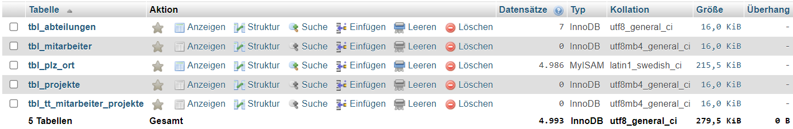
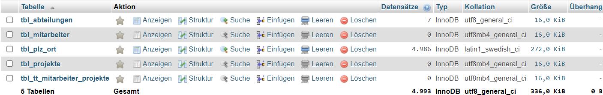

# Lernportfolio

- [Vergleich MariaDB & Mysql](#vergleich-mariadb--mysql)
- [Terminal & Codes](#terminal)
- [Status](#status)


# Tag 1


## Vergleich MariaDB & MySQL

MariaDB und MySQL sind beides populäre Open-Source-Datenbanksysteme, die weitgehend kompatibel sind, da MariaDB ursprünglich als Fork von MySQL entwickelt wurde. Die Unterschiede zwischen den beiden Systemen haben sich jedoch im Laufe der Zeit durch unabhängige Entwicklungen verstärkt. Hier sind einige Schlüsselaspekte zum Vergleich:

### Lizenzierung und Entwicklung
- **MySQL**: Gehört Oracle Corporation, nachdem sie Sun Microsystems, die Firma, die MySQL AB kaufte, übernommen haben. MySQL wird unter zwei Lizenzen veröffentlicht: der GNU General Public License (GPL) für die Community Edition und kommerzielle Lizenzen für die Enterprise Edition.
- **MariaDB**: Wurde als Reaktion auf die Übernahmen von MySQL durch Oracle gestartet, um die Open-Source-Zukunft von MySQL sicherzustellen. MariaDB wird ausschließlich unter der GPL lizenziert. Die Entwicklung scheint offener und community-orientierter zu sein.

### Kompatibilität
- **MySQL**: Hat eine breite Akzeptanz und Unterstützung in der Industrie, mit vielen Anwendungen und Webhosting-Services, die native Unterstützung bieten.
- **MariaDB**: Bietet nahezu vollständige Kompatibilität mit MySQL, was bedeutet, dass es in den meisten Fällen direkt als Ersatz dienen kann. MariaDB strebt an, alle neuen Versionen von MySQL zu absorbieren und kompatibel zu bleiben, fügt jedoch auch eigene Features hinzu.

### Leistung und Features
- **MySQL**: Bietet solide Leistung und ist für viele Anwendungen und Workloads gut geeignet. Oracle hat in den letzten Jahren viele Verbesserungen und neue Features eingeführt, einschließlich fortgeschrittener Optimierungen für InnoDB, dem Standard-Storage-Engine.
- **MariaDB**: Hat zusätzliche Storage-Engines wie Aria und TokuDB, die spezielle Anwendungsfälle unterstützen können. MariaDB hat sich auch auf die Verbesserung der Leistung und Features konzentriert, mit Innovationen wie der schnelleren und skalierbaren Galera Cluster Implementierung und Optimierungen für komplexe Abfragen.

### Sicherheit
- **MySQL** und **MariaDB** bieten beide starke Sicherheitsfeatures, einschließlich SSL-Verbindungen, Passwort-Verschlüsselung und Zugriffskontrollmechanismen. MariaDB hat jedoch einige zusätzliche Sicherheitsfeatures standardmäßig aktiviert und bietet Updates oft schneller an als MySQL.

### Community und Unterstützung
- **MySQL**: Profitiert von der Unterstützung durch Oracle und eine große Community von Entwicklern und Anwendern. Es gibt auch viele Ressourcen und Drittanbieter-Tools.
- **MariaDB**: Hat eine starke und wachsende Community, die sich für die Open-Source-Philosophie einsetzt. MariaDB Foundation und MariaDB Corporation bieten Unterstützung und Dienstleistungen an.

### Fazit
Die Wahl zwischen MariaDB und MySQL hängt von den spezifischen Anforderungen Ihres Projekts, Ihrer Philosophie bezüglich Open Source und möglicherweise von der vorhandenen Infrastruktur und Erfahrung Ihres Teams ab. MariaDB wird oft als die fortschrittlichere und community-orientierte Option angesehen, während MySQL die traditionelle Wahl mit starker Industrieunterstützung bleibt.

| Eigenschaft | MySQL | MariaDB |
|-------------|-------|---------|
| **Trägerschaft** | Oracle Corporation | MariaDB Foundation |
| **Lizenz** | GPL und kommerzielle Lizenzen | GPL |
| **Kompatibilität** | Industriestandard mit breiter Unterstützung | Nahezu vollständig kompatibel mit MySQL, mit eigenen Erweiterungen |
| **Leistung** | Fortgeschrittene Optimierungen für InnoDB | Zusätzliche Storage-Engines und Optimierungen für höhere Leistung |
| **Features** | Stabile und robuste Featureset | Führt neue Features und Optimierungen schneller ein |
| **Sicherheit** | Starke Sicherheitsfeatures | Zusätzliche Sicherheitsfeatures und schnelle Updates |
| **Community und Unterstützung** | Große Community mit Oracle Unterstützung | Starke, wachsende Community mit Fokus auf Open-Source |

***

| Eigenschaft                 | Beschreibung PostgresSQL|
|-----------------------------|--------------|
| **Standardskonformität**    | Hohe Einhaltung von SQL-Standards, unterstützt eine Vielzahl von Datentypen und Abfragen. |
| **Erweiterbarkeit**         | Benutzerdefinierte Typen, Funktionen und Sprachhandler können hinzugefügt werden, was die Anpassung an spezifische Bedürfnisse ermöglicht. |
| **Komplexe Abfragen**       | Unterstützt fortgeschrittene SQL-Features wie komplexe Abfragen, Unterabfragen und Joins. |
| **Transaktions- und Sicherheitsfeatures** | Bietet ACID-Transaktionen und umfassende Sicherheitsmechanismen für robuste Datenintegrität und -sicherheit. |
| **Verfügbarkeit und Zuverlässigkeit** | Features wie Point-in-Time Recovery und Asynchronous Replication unterstützen hohe Verfügbarkeit. |
| **Vorteile**                | Flexibilität, Leistungsfähigkeit, starke Community und Unterstützung, ideal für komplexe und große Datenmengen. |
| **Nachteile**               | Kann ressourcenintensiv sein, hat eine steilere Lernkurve im Vergleich zu einfacheren Systemen. |
| **Typische Anwendungsgebiete** | Unternehmensanwendungen, Web-Anwendungen, GIS, Analytik und Data Warehousing. |


## Terminal 

```cmd
c:\xampp\mysql\bin\mysqld --skip-grant-tables
```

```cmd
cd C:/
cd xampp
cd mysql
cd bin
.\mysql -u root -p
```

## Status


## Checkpoint

1.  Welches ist die heute am **häufigsten** verwendete Datenbank-Art?

    - [ ] Hierarchische Datenbank

    - [x] Relationale Datenbank

    - [ ] Objektorientierte Datenbank

    - [ ] Netzwerkförmige Datenbank

2.  Welche **Komponenten** sind in einem DB-Server enthalten?

    - [x] 1 oder mehrere Datenbanken

    - [ ] 1 oder mehrere Datenbank-Anwendungen

    - [x] Datenbank-Management-System (DBMS)

    - [x] Formulare, Reports und Abfragen

3.  Bei welchen der folgenden **Fabrikate** handelt es sich um eine relationale Datenbank?

    - [x] Oracle

    - [ ] Couch-DB

    - [x] MySQL

    - [x] MariaDB

    - [ ] Mongo-DB

    - [x] MS Access

    - [x] PostgreSQL °

4.  Welches sind Beispiele für **Aufgaben** eines DB-Clients?

    - [ ] speichert die eigentlichen Daten

    - [x] stellt dem Benutzer ein User-Interface für den Datenzugriff zur Verfügung

    - [ ] verwaltet Benutzer und Passworte und gewährleistet damit die Sicherheit der Datenbank

    - [x] leitet die Befehle des Benutzers an den DB-Server weiter

5.  Welches sind **Client-Komponenten** von MySQL?

    - [x] mysqld

    - [ ] my.ini

    - [ ] mysql

    - [x] phpMyAdmin
    
6.  Wie heisst die **Server-Komponente** von MySQL?

    - [ ] phpMyAdmin

    - [ ] Workbench °

    - [ ] mysql

    - [x] mysqld

7.  Beschreiben Sie den Begriff Client/Server-Modell.

    Das Client/Server-Modell ist ein Netzwerkarchitekturkonzept, bei dem Clients (Anforderer von Ressourcen) Anfragen an Server (Anbieter von Ressourcen) senden, die dann die angeforderten Dienste oder Daten bereitstellen.
      
8.  Welche Vorteile hat die Client/Server-Architektur gegenüber einer Desktop-DB?

    Vorteile der Client/Server-Architektur gegenüber einer Desktop-Datenbank umfassen verbesserte Zugriffskontrolle und Sicherheit, zentrale Datenverwaltung, höhere Skalierbarkeit, und die Möglichkeit, Ressourcen effizienter zu nutzen.
      
9.  Wie werden die Daten in einer relationalen Datenbank abgespeichert?

    In relationalen Datenbanken werden Daten in Tabellen abgespeichert, wobei jede Tabelle aus Reihen und Spalten besteht. Daten in einer Spalte sind vom gleichen Datentyp, während jede Reihe (Datensatz) eine einzigartige Instanz darstellt.
      
10.  Was sind die Vorteile, wenn ein DB-Server die **referentielle Datenintegrität** unterstützt?

    Die Unterstützung der referentiellen Datenintegrität in einem DB-Server gewährleistet, dass Beziehungen zwischen Tabellen konsistent bleiben, verhindert Dateninkonsistenzen und erleichtert die Datenpflege durch die Einhaltung von Beziehungsregeln.

11.  Welches sind die 4 Gruppen von **NoSQL**-Datenbanken, die zurzeit relevant sind?

    Die vier relevanten Gruppen von NoSQL-Datenbanken sind: Dokumentenorientierte Datenbanken, Schlüssel-Wert-Datenbanken, Spaltenorientierte Datenbanken, und Graphdatenbanken.
    
12.  Was bedeutet **DBaaS**? Erklären Sie anhand eines Beispiels. °

    DBaaS steht für "Database as a Service" und bezieht sich auf das Angebot von Datenbankdiensten über die Cloud. Ein Beispiel hierfür ist Amazon RDS, das die Einrichtung, den Betrieb und die Skalierung einer relationalen Datenbank in der Cloud vereinfacht.
    
13.  Was sind die Vorteile eines RDBMS gegenüber anderen DB-Modellen? °

    Vorteile eines RDBMS (Relationales Datenbankmanagementsystem) gegenüber anderen Datenbankmodellen umfassen die Unterstützung komplexer Abfragen und Transaktionen, die Einhaltung von ACID-Prinzipien für Transaktionssicherheit, verbesserte Datenintegrität durch relationale Integritätsbedingungen, und die effiziente Verwaltung großer Datenmengen.
    
14.  DB-Server starten und stoppen

    Stoppen und starten Sie Ihren DB-Server auf die verschiedenen Arten. Kontrollieren Sie jeweils das Resultat mit dem Task-Manager:

	-   Über das XAMPP – Control-Panel
	-   Via Konsole (CMD / WPS)
	-   Über die MySQL-Workbench (nur wenn der als Service läuft) 

    Im Task-Manager erscheint oder verschwindet der Prozess je nach Anwendung hat es jedoch einen anderen Namen
	
15. DB-Server prüfen

    Kontrollieren Sie, ob der MySQL-Server läuft mit dem

	-   Task-Manager von Windows: dort sollte ein Prozess mysqld.exe laufen.
	-   Dienst-Manager von Windows: der Dienst MySql sollte den Status gestartet haben.
	-   Mit den drei Klienten mysql, Workbench und phpMyAdmin

    
    
    
    
    


# Tag 2

## My.ini

```ini
PS C:\xampp\mysql\bin> get-content my.ini
# Example MySQL config file for small systems.
#
# This is for a system with little memory (<= 64M) where MySQL is only used
# from time to time and it's important that the mysqld daemon
# doesn't use much resources.
#
# You can copy this file to
# C:/xampp/mysql/bin/my.cnf to set global options,
# mysql-data-dir/my.cnf to set server-specific options (in this
# installation this directory is C:/xampp/mysql/data) or
# ~/.my.cnf to set user-specific options.
#
# In this file, you can use all long options that a program supports.
# If you want to know which options a program supports, run the program
# with the "--help" option.

# The following options will be passed to all MySQL clients
[client]
# password       = your_password
port=3306
socket="C:/xampp/mysql/mysql.sock"


# Here follows entries for some specific programs

# The MySQL server
default-character-set=utf8mb4
[mysqld]
port=3306
socket="C:/xampp/mysql/mysql.sock"
basedir="C:/xampp/mysql"
tmpdir="C:/xampp/tmp"
datadir="C:/xampp/mysql/data"
pid_file="mysql.pid"
# enable-named-pipe
key_buffer=16M
max_allowed_packet=1M
sort_buffer_size=512K
net_buffer_length=8K
read_buffer_size=256K
read_rnd_buffer_size=512K
myisam_sort_buffer_size=8M
log_error="mysql_error.log"

# Change here for bind listening
# bind-address="127.0.0.1"
# bind-address = ::1          # for ipv6

# Where do all the plugins live
plugin_dir="C:/xampp/mysql/lib/plugin/"

# Don't listen on a TCP/IP port at all. This can be a security enhancement,
# if all processes that need to connect to mysqld run on the same host.
# All interaction with mysqld must be made via Unix sockets or named pipes.
# Note that using this option without enabling named pipes on Windows
# (via the "enable-named-pipe" option) will render mysqld useless!
#
# commented in by lampp security
#skip-networking
#skip-federated

# Replication Master Server (default)
# binary logging is required for replication
# log-bin deactivated by default since XAMPP 1.4.11
#log-bin=mysql-bin

# required unique id between 1 and 2^32 - 1
# defaults to 1 if master-host is not set
# but will not function as a master if omitted
server-id       =1

# Replication Slave (comment out master section to use this)
#
# To configure this host as a replication slave, you can choose between
# two methods :
#
# 1) Use the CHANGE MASTER TO command (fully described in our manual) -
#    the syntax is:
#
#    CHANGE MASTER TO MASTER_HOST=<host>, MASTER_PORT=<port>,
#    MASTER_USER=<user>, MASTER_PASSWORD=<password> ;
#
#    where you replace <host>, <user>, <password> by quoted strings and
#    <port> by the master's port number (3306 by default).
#
#    Example:
#
#    CHANGE MASTER TO MASTER_HOST='125.564.12.1', MASTER_PORT=3306,
#    MASTER_USER='joe', MASTER_PASSWORD='secret';
#
# OR
#
# 2) Set the variables below. However, in case you choose this method, then
#    start replication for the first time (even unsuccessfully, for example
#    if you mistyped the password in master-password and the slave fails to
#    connect), the slave will create a master.info file, and any later
#    change in this file to the variables' values below will be ignored and
#    overridden by the content of the master.info file, unless you shutdown
#    the slave server, delete master.info and restart the slaver server.
#    For that reason, you may want to leave the lines below untouched
#    (commented) and instead use CHANGE MASTER TO (see above)
#
# required unique id between 2 and 2^32 - 1
# (and different from the master)
# defaults to 2 if master-host is set
# but will not function as a slave if omitted
#server-id       = 2
#
# The replication master for this slave - required
#master-host     =   <hostname>
#
# The username the slave will use for authentication when connecting
# to the master - required
#master-user     =   <username>
#
# The password the slave will authenticate with when connecting to
# the master - required
#master-password =   <password>
#
# The port the master is listening on.
# optional - defaults to 3306
#master-port     =  <port>
#
# binary logging - not required for slaves, but recommended
#log-bin=mysql-bin


# Point the following paths to different dedicated disks
#tmpdir = "C:/xampp/tmp"
#log-update = /path-to-dedicated-directory/hostname

# Uncomment the following if you are using BDB tables
#bdb_cache_size = 4M
#bdb_max_lock = 10000

# Comment the following if you are using InnoDB tables
#skip-innodb
innodb_data_home_dir="C:/xampp/mysql/data"
innodb_data_file_path=ibdata1:10M:autoextend
innodb_log_group_home_dir="C:/xampp/mysql/data"
#innodb_log_arch_dir = "C:/xampp/mysql/data"
## You can set .._buffer_pool_size up to 50 - 80 %
## of RAM but beware of setting memory usage too high
innodb_buffer_pool_size=16M
## Set .._log_file_size to 25 % of buffer pool size
innodb_log_file_size=5M
innodb_log_buffer_size=8M
innodb_flush_log_at_trx_commit=1
innodb_lock_wait_timeout=50

## UTF 8 Settings
#init-connect=\'SET NAMES utf8\'
#collation_server=utf8_unicode_ci
#character_set_server=utf8
#skip-character-set-client-handshake
#character_sets-dir="C:/xampp/mysql/share/charsets"
sql_mode=NO_ZERO_IN_DATE,NO_ZERO_DATE,NO_ENGINE_SUBSTITUTION
log_bin_trust_function_creators=1

character-set-server=utf8mb4
collation-server=utf8mb4_general_ci
[mysqldump]
max_allowed_packet=16M

[mysql]
# Remove the next comment character if you are not familiar with SQL
#safe-updates

[isamchk]
key_buffer=20M
sort_buffer_size=20M
read_buffer=2M
write_buffer=2M

[myisamchk]
key_buffer=20M
sort_buffer_size=20M
read_buffer=2M
write_buffer=2M

[mysqlhotcopy]
```

## Kollation

```sql
ALTER TABLE kollation.tbl_personen
add Nachname varchar(50) COLLATE utf8_general_ci NOT NULL AFTER Vorname;

select * from kollation.tbl_personen;

UPDATE kollation.tbl_personen SET Nachname = 'Müller' WHERE ID_person = 1;
UPDATE kollation.tbl_personen SET Nachname = 'Mueller' WHERE ID_person = 2;
UPDATE kollation.tbl_personen SET Nachname = 'Muller' WHERE ID_person = 3;
UPDATE kollation.tbl_personen SET Nachname = 'Straus' WHERE ID_person = 4;
UPDATE kollation.tbl_personen SET Nachname = 'Strauss' WHERE ID_person = 5;
UPDATE kollation.tbl_personen SET Nachname = 'Strauß' WHERE ID_person = 6;
UPDATE kollation.tbl_personen SET Nachname = 'Über' WHERE ID_person = 7;

ALTER TABLE kollation.tbl_personen CHARACTER SET utf8_general_ci COLLATE utf8mb4
```

## SQL-Befehle

| Tätigkeit                             | SQL-Befehl                                      | Grp | Risiko         |
|---------------------------------------|-------------------------------------------------|-----------|----------------|
| 1) alle Daten einer Tabelle anzeigen  | SELECT * FROM [Tabellenname];                   | DML       |         |
| 2) Datenbank auswählen                | USE [Datenbankname];                            | DDL       |         |
| 3) eine neue Datenbank erstellen      | CREATE DATABASE [Datenbankname];                | DDL       |         |
| 4) eine neue Tabelle erstellen        | CREATE TABLE [Tabellenname] ([Definitionen]);   | DDL       |         |
| 5) eine Tabelle löschen               | DROP TABLE [Tabellenname];                      | DDL       |         |
| 6) Tabellenstruktur kontrollieren     | DESCRIBE [Tabellenname];                        | DDL       |         |
| 7) Datenbanken anzeigen               | SHOW DATABASES;                                 | DDL       |         |
| 8) Tabellen einer DB anzeigen         | SHOW TABLES;                                    | DDL       |         |
| 9) Daten in eine Tabelle eintragen    | INSERT INTO [Tabellenname] VALUES ([Werte]);    | DML       |         |
| 10) Daten in einer Tabelle ändern     | UPDATE [Tabellenname] SET [Bedingungen];        | DML       | X         |
| 11) Daten in einer Tabelle löschen    | DELETE FROM [Tabellenname] WHERE [Bedingung];   | DML       | X         |
| 12) Spalte in einer Tabelle löschen   | ALTER TABLE [Tabellenname] DROP COLUMN [Spaltenname]; | DDL       | X         |


## Firma

```bash
103424 tbl_plz_ort.MYI

52224 tbl_plz_ort.MYI
```





## Checkpoint

Bei den folgenden Fragen treffen eine oder mehrere Antworten zu.

1.  Wie kann der MySQL-Server gestartet werden?

    - [ ] Start von `mysql.exe` im CMD-Fenster
    - [x] Start von `mysqld.exe` im CMD-Fenster
    - [x] über MySQL-Workbench
    - [ ] Eingabe von localhost als URL im Browser
    - [x] `NET START mysql` (im CMD-Fenster)
    - [x] mit dem Dienstmanager von Windows

2.  Welche Informationen erhalten Sie, wenn Sie im Konsolenfenster den Befehl *status* eingeben?

    - [ ] Version des Konsolenprogramms
    - [x] Betriebszeit des Servers
    - [x] Version des Servers
    - [x] Betriebszeit des Monitors

3.  Welche Daten befinden sich im Verzeichnis datadir (z. B. C:…\\mysql\\data)?

    - [x] Protokoll-Dateien (Log-Files)
    - [ ] Fehlerprotokolle
    - [ ] die ausführbaren MySQL-Programme, z.B. mysql.exe
    - [x] Datenbanken

4.  Wie prüfen Sie, ob der MySQL-Server läuft?

    - [x] mit dem Dienst-Manager von Windows
    - [ ] mit dem GUI-Tool Administrator
    - [ ] durch Eingabe des Befehls `status` im CMD-Fenster
    - [x] mit dem Task-Manager von Windows (Prozess)

5.  Wie testen Sie die Installation des DB-Servers?

    Testen mit Hilfe von MySQL-Clients

6.  Wie überprüfen Sie die Laufzeit des DB-Servers?

    Mit dem 'status' Befehl

7.  Wozu verwenden Sie das Programm mysql.exe? Wie starten Sie es?

    Es ist der MySQL-Client für die Konsole

8.  Notieren Sie 3 Informationen des status-Befehls mit ihrer Bedeutung.

    Server-Version: Zeigt die MySQL-Serverversion.
    Betriebszeit: Zeigt an, wie lange der Server bereits läuft.
    Aktuelle Threads: Zeigt die Anzahl der aktiven Threads.

9.  Nennen Sie 2 wichtige Verzeichnisse der MySQL-Installation mit ihrem Inhalt.

    bin: Enthält ausführbare Dateien wie mysql.exe.
    data: Enthält Datenbankdateien und Protokolle.
    
10.  Was ist der Inhalt der `my.ini` – Datei?

    Konfigurationseinstellungen für den MySQL-Server
    

11.  Welche Aussagen treffen zum Thema Codierung zu?

    - [ ] Ein Datenbankserver erkennt die Codierung einer Datei automatisch
    - [x] Codierung ist eine Vereinbarung zwischen dem Nutzer und dem System.
    - [x] Die Codierung legt fest, welche binäre Bitkombination zu welchem Zeichen gehört.
    - [ ] ANSI- und ASCII-Codierung ist dasselbe
    - [ ] Der Unicode-Zeichensatz hat 32 Bit Codelänge
    - [x] `UTF` bedeutet Unicode Transformation Format
    - [ ] `UTF-8 ` hat nur 8 Bit lange Zeichen aus dem Unicode-Zeichensat

12.  Welche Aussagen treffen zum Thema Byte Order Mark zu?

    - [ ] Ein BOM kann in Dateien jeglicher Art gesetzt werden.
    - [ ] Wenn das UTF-8-BOM "" bei einem Text-Editor sichtbar ist, erkennt er *es* nicht!
    - [x] Bei UTF-8 nutzt ein BOM nichts, da es nur 8 Bits zur Codierung verwendet!
    - [x] UTF-8 und UTF-16 verwenden unterschiedliche BOMs.!

13.  Welche Aussagen treffen zum Thema Kollation zu?

    - [ ] ist die Standard-Einstellung bei MySQL.
    - [ ] In der DIN-Normierung zur deutschen Kollation werden zwei Varianten zur Umlauthandhabung angeboten.
    - [ ] Die Endung "_ci" gibt an, dass die Sortierung die Gross-/Kleinschreibweise unterscheidet.
    - [x] Seit MySQL 5.5.3 sollte [utf8mb4](https://dev.mysql.com/doc/refman/5.5/en/charset-unicode-utf8mb4.html) anstelle von utf8 verwendet werden.
    - [ ] In der Konfig-Datei (my.ini) kann die UFT8-Codierung als Standard angegeben werden.
    - [ ] Eine Kollationseinstellung gilt für die ganze Tabelle (Entität).
    - [x] "Binärsortierung" ist die Sortierung anhand des binären Codes der verglichenen Zeichen.


14.  Mit welchem Befehl kontrollieren Sie die Struktur einer Tabelle?

    - [ ] SHOW DATABASES;
    - [x] SHOW CREATE TABLE *tabellenname*;
    - [x] DESC *tabellenname*; 
    - [x] DESCRIBE *tabellenname*;
    - [ ] SELECT * FROM *tabellenname*;
    - [ ] SHOW TABLE *tabellenname*;