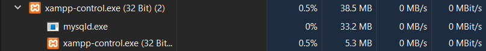

# Lernportfolio

- [Tag 1](#tag-1)
  	- [Vergleich MariaDB & Mysql](#vergleich-mariadb--mysql)
	- [Terminal & Codes](#terminal)
	- [Status](#status)


# Tag 1


## Vergleich MariaDB & MySQL

MariaDB und MySQL sind beides populäre Open-Source-Datenbanksysteme, die weitgehend kompatibel sind, da MariaDB ursprünglich als Fork von MySQL entwickelt wurde. Die Unterschiede zwischen den beiden Systemen haben sich jedoch im Laufe der Zeit durch unabhängige Entwicklungen verstärkt. Hier sind einige Schlüsselaspekte zum Vergleich:

### Lizenzierung und Entwicklung
- **MySQL**: Gehört Oracle Corporation, nachdem sie Sun Microsystems, die Firma, die MySQL AB kaufte, übernommen haben. MySQL wird unter zwei Lizenzen veröffentlicht: der GNU General Public License (GPL) für die Community Edition und kommerzielle Lizenzen für die Enterprise Edition.
- **MariaDB**: Wurde als Reaktion auf die Übernahmen von MySQL durch Oracle gestartet, um die Open-Source-Zukunft von MySQL sicherzustellen. MariaDB wird ausschließlich unter der GPL lizenziert. Die Entwicklung scheint offener und community-orientierter zu sein.

### Kompatibilität
- **MySQL**: Hat eine breite Akzeptanz und Unterstützung in der Industrie, mit vielen Anwendungen und Webhosting-Services, die native Unterstützung bieten.
- **MariaDB**: Bietet nahezu vollständige Kompatibilität mit MySQL, was bedeutet, dass es in den meisten Fällen direkt als Ersatz dienen kann. MariaDB strebt an, alle neuen Versionen von MySQL zu absorbieren und kompatibel zu bleiben, fügt jedoch auch eigene Features hinzu.

### Leistung und Features
- **MySQL**: Bietet solide Leistung und ist für viele Anwendungen und Workloads gut geeignet. Oracle hat in den letzten Jahren viele Verbesserungen und neue Features eingeführt, einschließlich fortgeschrittener Optimierungen für InnoDB, dem Standard-Storage-Engine.
- **MariaDB**: Hat zusätzliche Storage-Engines wie Aria und TokuDB, die spezielle Anwendungsfälle unterstützen können. MariaDB hat sich auch auf die Verbesserung der Leistung und Features konzentriert, mit Innovationen wie der schnelleren und skalierbaren Galera Cluster Implementierung und Optimierungen für komplexe Abfragen.

### Sicherheit
- **MySQL** und **MariaDB** bieten beide starke Sicherheitsfeatures, einschließlich SSL-Verbindungen, Passwort-Verschlüsselung und Zugriffskontrollmechanismen. MariaDB hat jedoch einige zusätzliche Sicherheitsfeatures standardmäßig aktiviert und bietet Updates oft schneller an als MySQL.

### Community und Unterstützung
- **MySQL**: Profitiert von der Unterstützung durch Oracle und eine große Community von Entwicklern und Anwendern. Es gibt auch viele Ressourcen und Drittanbieter-Tools.
- **MariaDB**: Hat eine starke und wachsende Community, die sich für die Open-Source-Philosophie einsetzt. MariaDB Foundation und MariaDB Corporation bieten Unterstützung und Dienstleistungen an.

### Fazit
Die Wahl zwischen MariaDB und MySQL hängt von den spezifischen Anforderungen Ihres Projekts, Ihrer Philosophie bezüglich Open Source und möglicherweise von der vorhandenen Infrastruktur und Erfahrung Ihres Teams ab. MariaDB wird oft als die fortschrittlichere und community-orientierte Option angesehen, während MySQL die traditionelle Wahl mit starker Industrieunterstützung bleibt.

| Eigenschaft | MySQL | MariaDB |
|-------------|-------|---------|
| **Trägerschaft** | Oracle Corporation | MariaDB Foundation |
| **Lizenz** | GPL und kommerzielle Lizenzen | GPL |
| **Kompatibilität** | Industriestandard mit breiter Unterstützung | Nahezu vollständig kompatibel mit MySQL, mit eigenen Erweiterungen |
| **Leistung** | Fortgeschrittene Optimierungen für InnoDB | Zusätzliche Storage-Engines und Optimierungen für höhere Leistung |
| **Features** | Stabile und robuste Featureset | Führt neue Features und Optimierungen schneller ein |
| **Sicherheit** | Starke Sicherheitsfeatures | Zusätzliche Sicherheitsfeatures und schnelle Updates |
| **Community und Unterstützung** | Große Community mit Oracle Unterstützung | Starke, wachsende Community mit Fokus auf Open-Source |

***

| Eigenschaft                 | Beschreibung PostgresSQL|
|-----------------------------|--------------|
| **Standardskonformität**    | Hohe Einhaltung von SQL-Standards, unterstützt eine Vielzahl von Datentypen und Abfragen. |
| **Erweiterbarkeit**         | Benutzerdefinierte Typen, Funktionen und Sprachhandler können hinzugefügt werden, was die Anpassung an spezifische Bedürfnisse ermöglicht. |
| **Komplexe Abfragen**       | Unterstützt fortgeschrittene SQL-Features wie komplexe Abfragen, Unterabfragen und Joins. |
| **Transaktions- und Sicherheitsfeatures** | Bietet ACID-Transaktionen und umfassende Sicherheitsmechanismen für robuste Datenintegrität und -sicherheit. |
| **Verfügbarkeit und Zuverlässigkeit** | Features wie Point-in-Time Recovery und Asynchronous Replication unterstützen hohe Verfügbarkeit. |
| **Vorteile**                | Flexibilität, Leistungsfähigkeit, starke Community und Unterstützung, ideal für komplexe und große Datenmengen. |
| **Nachteile**               | Kann ressourcenintensiv sein, hat eine steilere Lernkurve im Vergleich zu einfacheren Systemen. |
| **Typische Anwendungsgebiete** | Unternehmensanwendungen, Web-Anwendungen, GIS, Analytik und Data Warehousing. |


## Terminal 

```cmd
c:\xampp\mysql\bin\mysqld --skip-grant-tables
```

```cmd
cd C:/
cd xampp
cd mysql
cd bin
.\mysql -u root -p
```

## Status


## Checkpoint

1.  Welches ist die heute am **häufigsten** verwendete Datenbank-Art?

    - [ ] Hierarchische Datenbank

    - [x] Relationale Datenbank

    - [ ] Objektorientierte Datenbank

    - [ ] Netzwerkförmige Datenbank

2.  Welche **Komponenten** sind in einem DB-Server enthalten?

    - [x] 1 oder mehrere Datenbanken

    - [ ] 1 oder mehrere Datenbank-Anwendungen

    - [x] Datenbank-Management-System (DBMS)

    - [x] Formulare, Reports und Abfragen

3.  Bei welchen der folgenden **Fabrikate** handelt es sich um eine relationale Datenbank?

    - [x] Oracle

    - [ ] Couch-DB

    - [x] MySQL

    - [x] MariaDB

    - [ ] Mongo-DB

    - [x] MS Access

    - [x] PostgreSQL °

4.  Welches sind Beispiele für **Aufgaben** eines DB-Clients?

    - [ ] speichert die eigentlichen Daten

    - [x] stellt dem Benutzer ein User-Interface für den Datenzugriff zur Verfügung

    - [ ] verwaltet Benutzer und Passworte und gewährleistet damit die Sicherheit der Datenbank

    - [x] leitet die Befehle des Benutzers an den DB-Server weiter

5.  Welches sind **Client-Komponenten** von MySQL?

    - [x] mysqld

    - [ ] my.ini

    - [ ] mysql

    - [x] phpMyAdmin
    
6.  Wie heisst die **Server-Komponente** von MySQL?

    - [ ] phpMyAdmin

    - [ ] Workbench °

    - [ ] mysql

    - [x] mysqld

7.  Beschreiben Sie den Begriff Client/Server-Modell.

    Das Client/Server-Modell ist ein Netzwerkarchitekturkonzept, bei dem Clients (Anforderer von Ressourcen) Anfragen an Server (Anbieter von Ressourcen) senden, die dann die angeforderten Dienste oder Daten bereitstellen.
      
8.  Welche Vorteile hat die Client/Server-Architektur gegenüber einer Desktop-DB?

    Vorteile der Client/Server-Architektur gegenüber einer Desktop-Datenbank umfassen verbesserte Zugriffskontrolle und Sicherheit, zentrale Datenverwaltung, höhere Skalierbarkeit, und die Möglichkeit, Ressourcen effizienter zu nutzen.
      
9.  Wie werden die Daten in einer relationalen Datenbank abgespeichert?

    In relationalen Datenbanken werden Daten in Tabellen abgespeichert, wobei jede Tabelle aus Reihen und Spalten besteht. Daten in einer Spalte sind vom gleichen Datentyp, während jede Reihe (Datensatz) eine einzigartige Instanz darstellt.
      
10.  Was sind die Vorteile, wenn ein DB-Server die **referentielle Datenintegrität** unterstützt?

    Die Unterstützung der referentiellen Datenintegrität in einem DB-Server gewährleistet, dass Beziehungen zwischen Tabellen konsistent bleiben, verhindert Dateninkonsistenzen und erleichtert die Datenpflege durch die Einhaltung von Beziehungsregeln.

11.  Welches sind die 4 Gruppen von **NoSQL**-Datenbanken, die zurzeit relevant sind?

    Die vier relevanten Gruppen von NoSQL-Datenbanken sind: Dokumentenorientierte Datenbanken, Schlüssel-Wert-Datenbanken, Spaltenorientierte Datenbanken, und Graphdatenbanken.
    
12.  Was bedeutet **DBaaS**? Erklären Sie anhand eines Beispiels. °

    DBaaS steht für "Database as a Service" und bezieht sich auf das Angebot von Datenbankdiensten über die Cloud. Ein Beispiel hierfür ist Amazon RDS, das die Einrichtung, den Betrieb und die Skalierung einer relationalen Datenbank in der Cloud vereinfacht.
    
13.  Was sind die Vorteile eines RDBMS gegenüber anderen DB-Modellen? °

    Vorteile eines RDBMS (Relationales Datenbankmanagementsystem) gegenüber anderen Datenbankmodellen umfassen die Unterstützung komplexer Abfragen und Transaktionen, die Einhaltung von ACID-Prinzipien für Transaktionssicherheit, verbesserte Datenintegrität durch relationale Integritätsbedingungen, und die effiziente Verwaltung großer Datenmengen.
    
14.  DB-Server starten und stoppen

    Stoppen und starten Sie Ihren DB-Server auf die verschiedenen Arten. Kontrollieren Sie jeweils das Resultat mit dem Task-Manager:

	-   Über das XAMPP – Control-Panel
	-   Via Konsole (CMD / WPS)
	-   Über die MySQL-Workbench (nur wenn der als Service läuft) 

    Im Task-Manager erscheint oder verschwindet der Prozess je nach Anwendung hat es jedoch einen anderen Namen
	
15. DB-Server prüfen

    Kontrollieren Sie, ob der MySQL-Server läuft mit dem

	-   Task-Manager von Windows: dort sollte ein Prozess mysqld.exe laufen.
	-   Dienst-Manager von Windows: der Dienst MySql sollte den Status gestartet haben.
	-   Mit den drei Klienten mysql, Workbench und phpMyAdmin

    
    
    
    
    
