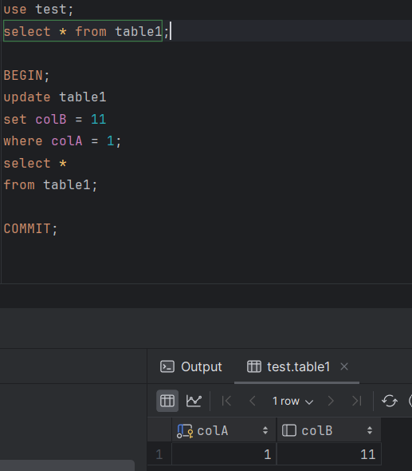
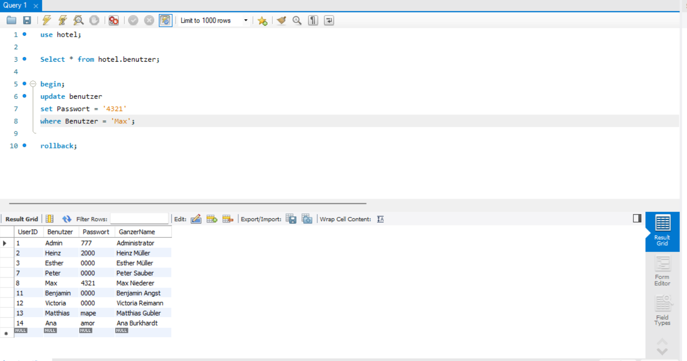

# Lernportfolio

- [Tag 1](#tag-1)
- [Tag 2](#tag-2)
- [Tag 3](#tag-3)
- [Tag 4](#tag-4)
- [Tag 5](#tag-5)
- [Tag 6](#tag-6)
- [Tag 7](#tag-7)


# Tag 1


## Vergleich MariaDB & MySQL

MariaDB und MySQL sind beides populäre Open-Source-Datenbanksysteme, die weitgehend kompatibel sind, da MariaDB ursprünglich als Fork von MySQL entwickelt wurde. Die Unterschiede zwischen den beiden Systemen haben sich jedoch im Laufe der Zeit durch unabhängige Entwicklungen verstärkt. Hier sind einige Schlüsselaspekte zum Vergleich:

### Lizenzierung und Entwicklung
- **MySQL**: Gehört Oracle Corporation, nachdem sie Sun Microsystems, die Firma, die MySQL AB kaufte, übernommen haben. MySQL wird unter zwei Lizenzen veröffentlicht: der GNU General Public License (GPL) für die Community Edition und kommerzielle Lizenzen für die Enterprise Edition.
- **MariaDB**: Wurde als Reaktion auf die Übernahmen von MySQL durch Oracle gestartet, um die Open-Source-Zukunft von MySQL sicherzustellen. MariaDB wird ausschließlich unter der GPL lizenziert. Die Entwicklung scheint offener und community-orientierter zu sein.

### Kompatibilität
- **MySQL**: Hat eine breite Akzeptanz und Unterstützung in der Industrie, mit vielen Anwendungen und Webhosting-Services, die native Unterstützung bieten.
- **MariaDB**: Bietet nahezu vollständige Kompatibilität mit MySQL, was bedeutet, dass es in den meisten Fällen direkt als Ersatz dienen kann. MariaDB strebt an, alle neuen Versionen von MySQL zu absorbieren und kompatibel zu bleiben, fügt jedoch auch eigene Features hinzu.

### Leistung und Features
- **MySQL**: Bietet solide Leistung und ist für viele Anwendungen und Workloads gut geeignet. Oracle hat in den letzten Jahren viele Verbesserungen und neue Features eingeführt, einschließlich fortgeschrittener Optimierungen für InnoDB, dem Standard-Storage-Engine.
- **MariaDB**: Hat zusätzliche Storage-Engines wie Aria und TokuDB, die spezielle Anwendungsfälle unterstützen können. MariaDB hat sich auch auf die Verbesserung der Leistung und Features konzentriert, mit Innovationen wie der schnelleren und skalierbaren Galera Cluster Implementierung und Optimierungen für komplexe Abfragen.

### Sicherheit
- **MySQL** und **MariaDB** bieten beide starke Sicherheitsfeatures, einschließlich SSL-Verbindungen, Passwort-Verschlüsselung und Zugriffskontrollmechanismen. MariaDB hat jedoch einige zusätzliche Sicherheitsfeatures standardmäßig aktiviert und bietet Updates oft schneller an als MySQL.

### Community und Unterstützung
- **MySQL**: Profitiert von der Unterstützung durch Oracle und eine große Community von Entwicklern und Anwendern. Es gibt auch viele Ressourcen und Drittanbieter-Tools.
- **MariaDB**: Hat eine starke und wachsende Community, die sich für die Open-Source-Philosophie einsetzt. MariaDB Foundation und MariaDB Corporation bieten Unterstützung und Dienstleistungen an.

### Fazit
Die Wahl zwischen MariaDB und MySQL hängt von den spezifischen Anforderungen Ihres Projekts, Ihrer Philosophie bezüglich Open Source und möglicherweise von der vorhandenen Infrastruktur und Erfahrung Ihres Teams ab. MariaDB wird oft als die fortschrittlichere und community-orientierte Option angesehen, während MySQL die traditionelle Wahl mit starker Industrieunterstützung bleibt.

| Eigenschaft | MySQL | MariaDB |
|-------------|-------|---------|
| **Trägerschaft** | Oracle Corporation | MariaDB Foundation |
| **Lizenz** | GPL und kommerzielle Lizenzen | GPL |
| **Kompatibilität** | Industriestandard mit breiter Unterstützung | Nahezu vollständig kompatibel mit MySQL, mit eigenen Erweiterungen |
| **Leistung** | Fortgeschrittene Optimierungen für InnoDB | Zusätzliche Storage-Engines und Optimierungen für höhere Leistung |
| **Features** | Stabile und robuste Featureset | Führt neue Features und Optimierungen schneller ein |
| **Sicherheit** | Starke Sicherheitsfeatures | Zusätzliche Sicherheitsfeatures und schnelle Updates |
| **Community und Unterstützung** | Große Community mit Oracle Unterstützung | Starke, wachsende Community mit Fokus auf Open-Source |

***

| Eigenschaft                 | Beschreibung PostgresSQL|
|-----------------------------|--------------|
| **Standardskonformität**    | Hohe Einhaltung von SQL-Standards, unterstützt eine Vielzahl von Datentypen und Abfragen. |
| **Erweiterbarkeit**         | Benutzerdefinierte Typen, Funktionen und Sprachhandler können hinzugefügt werden, was die Anpassung an spezifische Bedürfnisse ermöglicht. |
| **Komplexe Abfragen**       | Unterstützt fortgeschrittene SQL-Features wie komplexe Abfragen, Unterabfragen und Joins. |
| **Transaktions- und Sicherheitsfeatures** | Bietet ACID-Transaktionen und umfassende Sicherheitsmechanismen für robuste Datenintegrität und -sicherheit. |
| **Verfügbarkeit und Zuverlässigkeit** | Features wie Point-in-Time Recovery und Asynchronous Replication unterstützen hohe Verfügbarkeit. |
| **Vorteile**                | Flexibilität, Leistungsfähigkeit, starke Community und Unterstützung, ideal für komplexe und große Datenmengen. |
| **Nachteile**               | Kann ressourcenintensiv sein, hat eine steilere Lernkurve im Vergleich zu einfacheren Systemen. |
| **Typische Anwendungsgebiete** | Unternehmensanwendungen, Web-Anwendungen, GIS, Analytik und Data Warehousing. |


## Terminal 

```cmd
c:\xampp\mysql\bin\mysqld --skip-grant-tables
```

```cmd
cd C:/
cd xampp
cd mysql
cd bin
.\mysql -u root -p
```

## Status


## Checkpoint

1.  Welches ist die heute am **häufigsten** verwendete Datenbank-Art?

    - [ ] Hierarchische Datenbank

    - [x] Relationale Datenbank

    - [ ] Objektorientierte Datenbank

    - [ ] Netzwerkförmige Datenbank

2.  Welche **Komponenten** sind in einem DB-Server enthalten?

    - [x] 1 oder mehrere Datenbanken

    - [ ] 1 oder mehrere Datenbank-Anwendungen

    - [x] Datenbank-Management-System (DBMS)

    - [x] Formulare, Reports und Abfragen

3.  Bei welchen der folgenden **Fabrikate** handelt es sich um eine relationale Datenbank?

    - [x] Oracle

    - [ ] Couch-DB

    - [x] MySQL

    - [x] MariaDB

    - [ ] Mongo-DB

    - [x] MS Access

    - [x] PostgreSQL °

4.  Welches sind Beispiele für **Aufgaben** eines DB-Clients?

    - [ ] speichert die eigentlichen Daten

    - [x] stellt dem Benutzer ein User-Interface für den Datenzugriff zur Verfügung

    - [ ] verwaltet Benutzer und Passworte und gewährleistet damit die Sicherheit der Datenbank

    - [x] leitet die Befehle des Benutzers an den DB-Server weiter

5.  Welches sind **Client-Komponenten** von MySQL?

    - [x] mysqld

    - [ ] my.ini

    - [ ] mysql

    - [x] phpMyAdmin
    
6.  Wie heisst die **Server-Komponente** von MySQL?

    - [ ] phpMyAdmin

    - [ ] Workbench °

    - [ ] mysql

    - [x] mysqld

7.  Beschreiben Sie den Begriff Client/Server-Modell.

    Das Client/Server-Modell ist ein Netzwerkarchitekturkonzept, bei dem Clients (Anforderer von Ressourcen) Anfragen an Server (Anbieter von Ressourcen) senden, die dann die angeforderten Dienste oder Daten bereitstellen.
      
8.  Welche Vorteile hat die Client/Server-Architektur gegenüber einer Desktop-DB?

    Vorteile der Client/Server-Architektur gegenüber einer Desktop-Datenbank umfassen verbesserte Zugriffskontrolle und Sicherheit, zentrale Datenverwaltung, höhere Skalierbarkeit, und die Möglichkeit, Ressourcen effizienter zu nutzen.
      
9.  Wie werden die Daten in einer relationalen Datenbank abgespeichert?

    In relationalen Datenbanken werden Daten in Tabellen abgespeichert, wobei jede Tabelle aus Reihen und Spalten besteht. Daten in einer Spalte sind vom gleichen Datentyp, während jede Reihe (Datensatz) eine einzigartige Instanz darstellt.
      
10.  Was sind die Vorteile, wenn ein DB-Server die **referentielle Datenintegrität** unterstützt?

    Die Unterstützung der referentiellen Datenintegrität in einem DB-Server gewährleistet, dass Beziehungen zwischen Tabellen konsistent bleiben, verhindert Dateninkonsistenzen und erleichtert die Datenpflege durch die Einhaltung von Beziehungsregeln.

11.  Welches sind die 4 Gruppen von **NoSQL**-Datenbanken, die zurzeit relevant sind?

    Die vier relevanten Gruppen von NoSQL-Datenbanken sind: Dokumentenorientierte Datenbanken, Schlüssel-Wert-Datenbanken, Spaltenorientierte Datenbanken, und Graphdatenbanken.
    
12.  Was bedeutet **DBaaS**? Erklären Sie anhand eines Beispiels. °

    DBaaS steht für "Database as a Service" und bezieht sich auf das Angebot von Datenbankdiensten über die Cloud. Ein Beispiel hierfür ist Amazon RDS, das die Einrichtung, den Betrieb und die Skalierung einer relationalen Datenbank in der Cloud vereinfacht.
    
13.  Was sind die Vorteile eines RDBMS gegenüber anderen DB-Modellen? °

    Vorteile eines RDBMS (Relationales Datenbankmanagementsystem) gegenüber anderen Datenbankmodellen umfassen die Unterstützung komplexer Abfragen und Transaktionen, die Einhaltung von ACID-Prinzipien für Transaktionssicherheit, verbesserte Datenintegrität durch relationale Integritätsbedingungen, und die effiziente Verwaltung großer Datenmengen.
    
14.  DB-Server starten und stoppen

    Stoppen und starten Sie Ihren DB-Server auf die verschiedenen Arten. Kontrollieren Sie jeweils das Resultat mit dem Task-Manager:

	-   Über das XAMPP – Control-Panel
	-   Via Konsole (CMD / WPS)
	-   Über die MySQL-Workbench (nur wenn der als Service läuft) 

    Im Task-Manager erscheint oder verschwindet der Prozess je nach Anwendung hat es jedoch einen anderen Namen
	
15. DB-Server prüfen

    Kontrollieren Sie, ob der MySQL-Server läuft mit dem

	-   Task-Manager von Windows: dort sollte ein Prozess mysqld.exe laufen.
	-   Dienst-Manager von Windows: der Dienst MySql sollte den Status gestartet haben.
	-   Mit den drei Klienten mysql, Workbench und phpMyAdmin

    
    
    
    
    


# Tag 2

## My.ini

```ini
PS C:\xampp\mysql\bin> get-content my.ini
# Example MySQL config file for small systems.
#
# This is for a system with little memory (<= 64M) where MySQL is only used
# from time to time and it's important that the mysqld daemon
# doesn't use much resources.
#
# You can copy this file to
# C:/xampp/mysql/bin/my.cnf to set global options,
# mysql-data-dir/my.cnf to set server-specific options (in this
# installation this directory is C:/xampp/mysql/data) or
# ~/.my.cnf to set user-specific options.
#
# In this file, you can use all long options that a program supports.
# If you want to know which options a program supports, run the program
# with the "--help" option.

# The following options will be passed to all MySQL clients
[client]
# password       = your_password
port=3306
socket="C:/xampp/mysql/mysql.sock"


# Here follows entries for some specific programs

# The MySQL server
default-character-set=utf8mb4
[mysqld]
port=3306
socket="C:/xampp/mysql/mysql.sock"
basedir="C:/xampp/mysql"
tmpdir="C:/xampp/tmp"
datadir="C:/xampp/mysql/data"
pid_file="mysql.pid"
# enable-named-pipe
key_buffer=16M
max_allowed_packet=1M
sort_buffer_size=512K
net_buffer_length=8K
read_buffer_size=256K
read_rnd_buffer_size=512K
myisam_sort_buffer_size=8M
log_error="mysql_error.log"

# Change here for bind listening
# bind-address="127.0.0.1"
# bind-address = ::1          # for ipv6

# Where do all the plugins live
plugin_dir="C:/xampp/mysql/lib/plugin/"

# Don't listen on a TCP/IP port at all. This can be a security enhancement,
# if all processes that need to connect to mysqld run on the same host.
# All interaction with mysqld must be made via Unix sockets or named pipes.
# Note that using this option without enabling named pipes on Windows
# (via the "enable-named-pipe" option) will render mysqld useless!
#
# commented in by lampp security
#skip-networking
#skip-federated

# Replication Master Server (default)
# binary logging is required for replication
# log-bin deactivated by default since XAMPP 1.4.11
#log-bin=mysql-bin

# required unique id between 1 and 2^32 - 1
# defaults to 1 if master-host is not set
# but will not function as a master if omitted
server-id       =1

# Replication Slave (comment out master section to use this)
#
# To configure this host as a replication slave, you can choose between
# two methods :
#
# 1) Use the CHANGE MASTER TO command (fully described in our manual) -
#    the syntax is:
#
#    CHANGE MASTER TO MASTER_HOST=<host>, MASTER_PORT=<port>,
#    MASTER_USER=<user>, MASTER_PASSWORD=<password> ;
#
#    where you replace <host>, <user>, <password> by quoted strings and
#    <port> by the master's port number (3306 by default).
#
#    Example:
#
#    CHANGE MASTER TO MASTER_HOST='125.564.12.1', MASTER_PORT=3306,
#    MASTER_USER='joe', MASTER_PASSWORD='secret';
#
# OR
#
# 2) Set the variables below. However, in case you choose this method, then
#    start replication for the first time (even unsuccessfully, for example
#    if you mistyped the password in master-password and the slave fails to
#    connect), the slave will create a master.info file, and any later
#    change in this file to the variables' values below will be ignored and
#    overridden by the content of the master.info file, unless you shutdown
#    the slave server, delete master.info and restart the slaver server.
#    For that reason, you may want to leave the lines below untouched
#    (commented) and instead use CHANGE MASTER TO (see above)
#
# required unique id between 2 and 2^32 - 1
# (and different from the master)
# defaults to 2 if master-host is set
# but will not function as a slave if omitted
#server-id       = 2
#
# The replication master for this slave - required
#master-host     =   <hostname>
#
# The username the slave will use for authentication when connecting
# to the master - required
#master-user     =   <username>
#
# The password the slave will authenticate with when connecting to
# the master - required
#master-password =   <password>
#
# The port the master is listening on.
# optional - defaults to 3306
#master-port     =  <port>
#
# binary logging - not required for slaves, but recommended
#log-bin=mysql-bin


# Point the following paths to different dedicated disks
#tmpdir = "C:/xampp/tmp"
#log-update = /path-to-dedicated-directory/hostname

# Uncomment the following if you are using BDB tables
#bdb_cache_size = 4M
#bdb_max_lock = 10000

# Comment the following if you are using InnoDB tables
#skip-innodb
innodb_data_home_dir="C:/xampp/mysql/data"
innodb_data_file_path=ibdata1:10M:autoextend
innodb_log_group_home_dir="C:/xampp/mysql/data"
#innodb_log_arch_dir = "C:/xampp/mysql/data"
## You can set .._buffer_pool_size up to 50 - 80 %
## of RAM but beware of setting memory usage too high
innodb_buffer_pool_size=16M
## Set .._log_file_size to 25 % of buffer pool size
innodb_log_file_size=5M
innodb_log_buffer_size=8M
innodb_flush_log_at_trx_commit=1
innodb_lock_wait_timeout=50

## UTF 8 Settings
#init-connect=\'SET NAMES utf8\'
#collation_server=utf8_unicode_ci
#character_set_server=utf8
#skip-character-set-client-handshake
#character_sets-dir="C:/xampp/mysql/share/charsets"
sql_mode=NO_ZERO_IN_DATE,NO_ZERO_DATE,NO_ENGINE_SUBSTITUTION
log_bin_trust_function_creators=1

character-set-server=utf8mb4
collation-server=utf8mb4_general_ci
[mysqldump]
max_allowed_packet=16M

[mysql]
# Remove the next comment character if you are not familiar with SQL
#safe-updates

[isamchk]
key_buffer=20M
sort_buffer_size=20M
read_buffer=2M
write_buffer=2M

[myisamchk]
key_buffer=20M
sort_buffer_size=20M
read_buffer=2M
write_buffer=2M

[mysqlhotcopy]
```

## Kollation

```sql
ALTER TABLE kollation.tbl_personen
add Nachname varchar(50) COLLATE utf8_general_ci NOT NULL AFTER Vorname;

select * from kollation.tbl_personen;

UPDATE kollation.tbl_personen SET Nachname = 'Müller' WHERE ID_person = 1;
UPDATE kollation.tbl_personen SET Nachname = 'Mueller' WHERE ID_person = 2;
UPDATE kollation.tbl_personen SET Nachname = 'Muller' WHERE ID_person = 3;
UPDATE kollation.tbl_personen SET Nachname = 'Straus' WHERE ID_person = 4;
UPDATE kollation.tbl_personen SET Nachname = 'Strauss' WHERE ID_person = 5;
UPDATE kollation.tbl_personen SET Nachname = 'Strauß' WHERE ID_person = 6;
UPDATE kollation.tbl_personen SET Nachname = 'Über' WHERE ID_person = 7;

ALTER TABLE kollation.tbl_personen CHARACTER SET utf8_general_ci COLLATE utf8mb4
```

## SQL-Befehle

| Tätigkeit                             | SQL-Befehl                                      | Grp | Risiko         |
|---------------------------------------|-------------------------------------------------|-----------|----------------|
| 1) alle Daten einer Tabelle anzeigen  | SELECT * FROM [Tabellenname];                   | DML       |         |
| 2) Datenbank auswählen                | USE [Datenbankname];                            | DDL       |         |
| 3) eine neue Datenbank erstellen      | CREATE DATABASE [Datenbankname];                | DDL       |         |
| 4) eine neue Tabelle erstellen        | CREATE TABLE [Tabellenname] ([Definitionen]);   | DDL       |         |
| 5) eine Tabelle löschen               | DROP TABLE [Tabellenname];                      | DDL       |         |
| 6) Tabellenstruktur kontrollieren     | DESCRIBE [Tabellenname];                        | DDL       |         |
| 7) Datenbanken anzeigen               | SHOW DATABASES;                                 | DDL       |         |
| 8) Tabellen einer DB anzeigen         | SHOW TABLES;                                    | DDL       |         |
| 9) Daten in eine Tabelle eintragen    | INSERT INTO [Tabellenname] VALUES ([Werte]);    | DML       |         |
| 10) Daten in einer Tabelle ändern     | UPDATE [Tabellenname] SET [Bedingungen];        | DML       | X         |
| 11) Daten in einer Tabelle löschen    | DELETE FROM [Tabellenname] WHERE [Bedingung];   | DML       | X         |
| 12) Spalte in einer Tabelle löschen   | ALTER TABLE [Tabellenname] DROP COLUMN [Spaltenname]; | DDL       | X         |


## Firma

```bash
103424 tbl_plz_ort.MYI

52224 tbl_plz_ort.MYI
```


## Checkpoint

Bei den folgenden Fragen treffen eine oder mehrere Antworten zu.

1.  Wie kann der MySQL-Server gestartet werden?

    - [ ] Start von `mysql.exe` im CMD-Fenster
    - [x] Start von `mysqld.exe` im CMD-Fenster
    - [x] über MySQL-Workbench
    - [ ] Eingabe von localhost als URL im Browser
    - [x] `NET START mysql` (im CMD-Fenster)
    - [x] mit dem Dienstmanager von Windows

2.  Welche Informationen erhalten Sie, wenn Sie im Konsolenfenster den Befehl *status* eingeben?

    - [ ] Version des Konsolenprogramms
    - [x] Betriebszeit des Servers
    - [x] Version des Servers
    - [x] Betriebszeit des Monitors

3.  Welche Daten befinden sich im Verzeichnis datadir (z. B. C:…\\mysql\\data)?

    - [x] Protokoll-Dateien (Log-Files)
    - [ ] Fehlerprotokolle
    - [ ] die ausführbaren MySQL-Programme, z.B. mysql.exe
    - [x] Datenbanken

4.  Wie prüfen Sie, ob der MySQL-Server läuft?

    - [x] mit dem Dienst-Manager von Windows
    - [ ] mit dem GUI-Tool Administrator
    - [ ] durch Eingabe des Befehls `status` im CMD-Fenster
    - [x] mit dem Task-Manager von Windows (Prozess)

5.  Wie testen Sie die Installation des DB-Servers?

    Testen mit Hilfe von MySQL-Clients

6.  Wie überprüfen Sie die Laufzeit des DB-Servers?

    Mit dem 'status' Befehl

7.  Wozu verwenden Sie das Programm mysql.exe? Wie starten Sie es?

    Es ist der MySQL-Client für die Konsole

8.  Notieren Sie 3 Informationen des status-Befehls mit ihrer Bedeutung.

    Server-Version: Zeigt die MySQL-Serverversion.
    Betriebszeit: Zeigt an, wie lange der Server bereits läuft.
    Aktuelle Threads: Zeigt die Anzahl der aktiven Threads.

9.  Nennen Sie 2 wichtige Verzeichnisse der MySQL-Installation mit ihrem Inhalt.

    bin: Enthält ausführbare Dateien wie mysql.exe.
    data: Enthält Datenbankdateien und Protokolle.
    
10.  Was ist der Inhalt der `my.ini` – Datei?

    Konfigurationseinstellungen für den MySQL-Server
    

11.  Welche Aussagen treffen zum Thema Codierung zu?

    - [ ] Ein Datenbankserver erkennt die Codierung einer Datei automatisch
    - [x] Codierung ist eine Vereinbarung zwischen dem Nutzer und dem System.
    - [x] Die Codierung legt fest, welche binäre Bitkombination zu welchem Zeichen gehört.
    - [ ] ANSI- und ASCII-Codierung ist dasselbe
    - [ ] Der Unicode-Zeichensatz hat 32 Bit Codelänge
    - [x] `UTF` bedeutet Unicode Transformation Format
    - [ ] `UTF-8 ` hat nur 8 Bit lange Zeichen aus dem Unicode-Zeichensat

12.  Welche Aussagen treffen zum Thema Byte Order Mark zu?

    - [ ] Ein BOM kann in Dateien jeglicher Art gesetzt werden.
    - [ ] Wenn das UTF-8-BOM "" bei einem Text-Editor sichtbar ist, erkennt er *es* nicht!
    - [x] Bei UTF-8 nutzt ein BOM nichts, da es nur 8 Bits zur Codierung verwendet!
    - [x] UTF-8 und UTF-16 verwenden unterschiedliche BOMs.!

13.  Welche Aussagen treffen zum Thema Kollation zu?

    - [ ] ist die Standard-Einstellung bei MySQL.
    - [ ] In der DIN-Normierung zur deutschen Kollation werden zwei Varianten zur Umlauthandhabung angeboten.
    - [ ] Die Endung "_ci" gibt an, dass die Sortierung die Gross-/Kleinschreibweise unterscheidet.
    - [x] Seit MySQL 5.5.3 sollte [utf8mb4](https://dev.mysql.com/doc/refman/5.5/en/charset-unicode-utf8mb4.html) anstelle von utf8 verwendet werden.
    - [ ] In der Konfig-Datei (my.ini) kann die UFT8-Codierung als Standard angegeben werden.
    - [ ] Eine Kollationseinstellung gilt für die ganze Tabelle (Entität).
    - [x] "Binärsortierung" ist die Sortierung anhand des binären Codes der verglichenen Zeichen.


14.  Mit welchem Befehl kontrollieren Sie die Struktur einer Tabelle?

    - [ ] SHOW DATABASES;
    - [x] SHOW CREATE TABLE *tabellenname*;
    - [x] DESC *tabellenname*; 
    - [x] DESCRIBE *tabellenname*;
    - [ ] SELECT * FROM *tabellenname*;
    - [ ] SHOW TABLE *tabellenname*;

# Tag 3


***




***





## Tabellentypen und Transaktionen
1.  Wie bezeichnet man die Ausführung mehrerer DB-Operationen in einem einzigen Schritt?

    - [ ] Referentielle Integrität

    - [ ] Replikation

    - [x] Transaktion

    - [ ] Storage Procedure

2.  Warum sollen Locks möglichst schnell freigegeben werden?

    - [ ] damit das DBMS nicht zu stark belastet wird

    - [x] damit andere DB-Anwender nicht lange warten müssen

    - [ ] damit niemand die Daten ändern kann

    - [ ] damit möglichst viele Benutzer gleichzeitig auf die DB zugreifen können

3.  Welches ist das Standard-Tabellenformat von MySQL (MariaDB)?

    - [x] InnoDB

    - [ ] MyISAM

    - [ ] ARIA

    - [ ] ISAM

4.  Wann verwenden Sie das InnoDB-Tabellenformat?

    - [ ] wenn möglichst schnell auf die Daten zugegriffen werden muss

    - [ ] wenn auf gar keinen Fall ein Datenverlust vorkommen darf

    - [x] wenn viele Benutzer gleichzeitig Daten ändern

    - [ ] wenn bei sehr vielen Daten nicht beliebig viel Speicherplatz vorhanden ist

5.  Was trifft auf den sog. Tablespace zu?

    - [ ] Datei, welche die Daten der entsprechenden Tabelle enthält (\*.MYD)

    - [ ] Datei, welche Beschreibung, Daten und Indexe einer Tabelle enthält

    - [x] Datei, welche alle InnoDB-Tabellen enthält (virtueller Speicher)

    - [ ] wird nach Erreichen von x MB automatisch vergrössert (falls autoextend eingeschaltet)
    
6.  Mit welchen Befehlen werden Transaktionen gesteuert?

    - [ ] UNLOCK TABLES;

    - [x] COMMIT; oder ROLLBACK;

    - [ ] ALTER TABLE ... TYPE= ...;

    - [x] BEGIN; oder START TRANSACTION;

7.  Was trifft auf das Locking bei Transaktionen auf InnoDB-Tabellen zu?

    - [ ] in Transaktionen kommt Table locking zur Anwendung

    - [x] es wird Row locking angewendet

    - [ ] es werden alle Datensätze der entsprechenden Tabelle(n) gesperrt

    - [x] es werden nur die gerade bearbeiteten Datensätze gesperrt

8.  Welches sind Vorteile der InnoDB-Tabellen gegenüber MyISAM-Tabellen?

    Unterstützung von Transaktionen (ACID-Kompatibilität)
    Bessere Wiederherstellung nach Abstürzen
    Unterstützung von Fremdschlüsseln
    Row-Level Locking (im Gegensatz zum Table-Level Locking bei MyISAM)  
      

9.  In welchen Dateien wird die MyISAM-Tabelle KUNDEN gespeichert?

    KUNDEN.MYD (für Daten), KUNDEN.MYI (für Indizes), KUNDEN.frm (für die Tabellenstruktur).
      

10.  Notieren Sie den SQL-Befehl, der die InnoDB-Tabelle BESTELLUNGEN erstellt.
    
    CREATE TABLE BESTELLUNGEN (
    
    ) ENGINE=InnoDB;
      

11.  Welche Locking-Art ist a) bei MyISAM-Tabellen b) bei InnoDB-Tabellen möglich?

    a) bei MyISAM-Tabellen: Table locking
    b) bei InnoDB-Tabellen: Row locking   
      

12.  Beschreiben Sie den Begriff Datenbank-Transaktion!

    Eine Transaktion kann aus mehreren Befehlen bestehen; beispielsweise besteht eine Geldüberweisung aus zwei Befehlen: Der Betrag muss vom einen Konto abgezogen werden, und dann zum anderen Konto hinzugefügt werden.
      

13.  Beschreiben Sie die Bedeutung von I in der Abkürzung ACID.

    Isolation stellt sicher, dass Transaktionen isoliert von den Änderungen anderer Transaktionen ausgeführt werden. 
      

14.  Wie stellen Transaktionen bei einem DB-Server-Crash die Datenkonsistenz sicher? (Schwierig)

    Indem sie unvollständige Transaktionen beim Neustart zurückrollen und vollständige Transaktionen wiederherstellen, basierend auf den Log-Dateien
  
15. Mit welcher Locking-Art wartet ein SELECT-Befehl, bis alle Transaktionen auf die angeforderte Tabelle entsperrt sind? 

    Dies hängt von der Konfiguration und dem verwendeten Isolation Level ab. Normalerweise sollten Select-Befehle bei InnoDB nicht auf andere Transaktionen warten, es sei denn, sie verwenden Locks oder es wird ein höherer Isolationslevel wie Serializable verwendet. 
          
16. Wie muss Autocommit gesetzt werden, damit jeder SQL-Befehl zu einer Transaktion gehört und damit explizit mit COMMIT abgeschlossen werden muss, damit er ausgeführt wird? 

    Autocommit muss auf OFF gesetzt werden, damit jeder SQL-Befehl zu einer Transaktion gehört und explizit mit COMMIT abgeschlossen werden muss, bevor er ausgeführt wird.

# Tag 4


## Datenbank-Sicherheit

1.  Was bedeutet der Begriff Authentifizierung im Zusammenhang mit einem DB-Server?

    - [ ] Prüfung der Privilegien des Benutzers

    - [x] Antwort auf die Frage Wer?

    - [ ] Identitätsprüfung

    - [ ] Antwort auf die Frage Was?

2.  Wann werden Änderungen im Zugriffssystem von MySQL wirksam?

    - [ ] sofort nach Eingabe der Änderung

    - [x] nach dem Befehl FLUSH PRIVILEGES

    - [ ] nach dem Neustart des DB-Servers

    - [ ] nach dem Befehl GRANT

3.  Was bewirkt der SQL-Befehl GRANT ... ON ... TO ...;

    - [x] Privileg(ien) erteilen

    - [ ] Privileg(ien) wegnehmen

    - [ ] User erstellen, falls noch nicht vorhanden

    - [ ] User löschen

4.  Mit welchem Befehl werden Privilegien kontrolliert?

    - [ ] REVOKE ... ON ... FROM ;

    - [ ] SELECT user, host, password FROM user ;

    - [ ] SHOW TABLES;

    - [x] SHOW GRANTS FOR ... ;

5.  Welches sind die beiden wichtigsten DCL-Befehle (data control)?

    - [ ] SELECT

    - [x] REVOKE

    - [ ] DELETE

    - [x] GRANT
    
6.  Was ist nötig, dass Benutzer "meier" keinen Zugang mehr auf den DB-Server hat.

    - [ ] in Systemtabelle user für diesen Benutzer jedes Privileg auf "N" setzen

    - [x] mit DELETE FROM user WHERE user = 'meier'; und FLUSH PRIVILEGES;

    - [ ] in allen Systemtabellen für diesen Benutzer jedes Privileg auf "N" setzen

    - [ ] dem Benutzer das GRANT-Privileg (Grant_priv) wegnehmen

7.  Erklären Sie den Begriff "Autorisierung" im Zusammenhang mit einem DB-Server.

    Das bedeutet, dass festgelegt wird, welche Aktionen der authentifizierte Benutzer ausführen darf.
      

8.  Wann wird das Schlüsselwort IDENTIFIED BY verwendet?

    Das wird verwendet, um beim Erstellen eines Benutzers oder beim Ändern des Passworts das Passwort festzulegen  
      

9.  Ergänzen Sie den Befehl REVOKE ... ON ... FROM ... ; mit eigenen Angaben.

    REVOKE SELECT ON database.schule FROM 'luca'@'localhost';
      
10.  Beschreiben Sie den Begriff der MySQL-Testdatenbank.

    Das ist eine Datenbank, die zu Testzwecken verwendet wird, um sicherzustellen, dass Abfragen und Prozesse korrekt funktionieren, ohne echte Daten zu beeinträchtigen.  
      

11.  Mit welchem Befehl ändern Sie das Passwort von Benutzer Meier auf "abc123"?

    ALTER USER 'Meier' IDENTIFIED BY 'abc123';
      

12.  Geben Sie eine Erklärung für folgende Fehlermeldung.  
    
    ```  
    GRANT USAGE ON \*.\* TO abc IDENTIFIED BY 'a12';  
    ERROR 1045: Access denied for user: '@127.0.0.1'
    ```
    
    Der Benutzer 'abc' hat keine Berechtigung, Privilegien zu erhalten, oder das Passwort 'a12' entspricht nicht den Sicherheitsanforderungen.  
      

13.  Korrigieren Sie den folgenden Befehl:  
    
    ```  
    REVOKE ALL FROM ''@localhost;  
    ERROR 1064: You have an error
    ```
    
    REVOKE ALL PRIVILEGES ON . FROM 'user'@'localhost';

# Tag 5

## Grundlagen:
- **DB-Server im LAN**: Die Dezentralisierung in der Informatik führt zur Verteilung von Aufgaben und Daten auf mehrere Rechner im Netzwerk. Dies verbessert Datenverfügbarkeit, Datensicherheit, Flexibilität, Performance und Kosten.

- **Zugriff über das Netz**: Der Zugriff auf den DB-Server über das Netzwerk erfordert die Angabe der Netzwerkadresse des Servers. Bei einer Firewall muss der Port 3306 geöffnet sein.

## Netzwerkkommunikation und -konfiguration:
- **Verbindung zum DB-Server testen**: Überprüfung der Netzverbindung und des DB-Servers mit `ping` und `mysqladmin`.
- **Backup und Restore über das Netz**: Durchführen von Sicherungs- und Wiederherstellungsaktionen unter Angabe der Serveradresse.
- **Zugriffssteuerung**: Zeitweises Verbot des Netzwerkzugriffs auf den DB-Server durch Einstellungen in der Konfigurationsdatei (`skip-networking`).

## ODBC-Interface:
- **Einleitung**: ODBC (Open Database Connectivity) ist eine Middleware zur einheitlichen Datenbankanbindung, besonders genutzt in Windows-Umgebungen.
- **Konfiguration und Test**: Installation des ODBC-Treibers und Einrichtung eines Data Source Name (DSN) zur Verbindung mit der Datenbank.

## Zugriff von Access auf MySQL-Datenbank:
- **Integration**: Kombination der Vorteile von Access und MySQL durch Einbindung von MySQL-Tabellen in Access.
- **Datentypen und Abfragen**: Anpassung der Datentypen für Kompatibilität und Erstellung von Abfragen und Formularen in Access, die auf MySQL-Tabellen zugreifen.

## DB-Server im LAN

1.  Welcher Befehl testet die Verbindung zum Server-Rechner mit Adresse 139.79.124.97?

    - [ ] mysql -h 139.79.124.97

    - [ ] ipconfig

    - [x] ping 139.79.124.97

    - [ ] mysqladmin -h 139.79.124.97 -u root -p ping

2.  Wozu wird der Parameter -h bei MySQL verwendet?

    - [ ] bewirkt die Abfrage des Passworts

    - [ ] bewirkt die Verbindung als bestimmter Benutzer

    - [ ] Angabe der Adresse des Client-Rechners

    - [x] Angabe der Adresse des Server-Rechners

3.  Was bewirkt der Befehl 'mysqldump -h 139.79.124.97 hotel \> datei.txt'?

    - [ ] Backup der DB hotel in die Datei datei.txt auf Adresse 139.79.124.97

    - [x] Backup der angegebenen DB auf dem Server mit der IP-Adresse 139.79.124.97

    - [ ] Restore der Datenbank hotel auf dem Server mit der Adresse 139.79.124.97

    - [ ] Ausführen des SQL-Skripts datei.txt auf Adresse 139.79.124.97 auf die DB hotel

4.  Welche Aufgabe hat der ODBC-Driver?

    - [ ] passt die SQL-Befehle dem entsprechenden DB-Server an

    - [ ] ermöglicht das Erstellen und Konfigurieren von ODBC-Datenquellen (DSN)

    - [x] ermöglicht den einheitlichen Zugriff einer Applikation auf verschiedene Datenbanken

    - [ ] ermöglicht den Zugriff einer Applikation auf eine bestimmte DB

5.  Wie greifen Sie vom Konsolenfenster auf einen DB-Server mit Adresse 139.79.124.97 zu?

    - [ ] mysqladmin -h 139.79.124.97

    - [ ] mysql -h 139.79.124.97 hotel \< hotel.bkp

    - [x] mysql -h 139.79.124.97 -u root -p

    - [ ] ping 139.79.124.97

1.  Welche Aufgaben hat der DB-Server im Gegensatz zum DB-Client?

    Der DB-Server verwaltet die Datenbank und verarbeitet Anfragen von Clients. Er ist für die Speicherung, Abfrage und Aktualisierung der Daten verantwortlich. Der DB-Client hingegen sendet Anfragen an den Server, um mit der Datenbank zu interagieren, z.B. Daten abzufragen oder zu ändern.   
      

2.  Weshalb benutzt man MS Access z.B. zusammen mit einem MySQL-Server?

    MS Access kann als Frontend für Benutzerschnittstellen und Berichte genutzt werden, während ein MySQL-Server im Hintergrund als leistungsfähige Datenbank dient, die große Mengen von Daten verwalten kann. 
      

3.  Wie bestimmen Sie die IP-Adresse des Server-Rechners?

    Man kann die IP-Adresse eines Servers in einem Netzwerk mit dem Befehl ipconfig im Terminal ermitteln.
      

4.  Wie prüfen Sie, ob der DB-Server auf Adresse 139.79.124.97 läuft?

    Dies kann mam überprüfen, indem man den Befehl ping 139.79.124.97 nutzen oder versuchen, mit einem Datenbank-Client eine Verbindung herzustellen.
      

5.  Welcher Befehl führt das SQL-Skript xy.sql auf die DB hotel auf Adresse 139.79.124.97 aus?

    Der Befehl könnte so aussehen: mysql -h 139.79.124.97 -u [username] -p[password] hotel < xy.sql
      

6.  Wozu wird ODBC verwendet?

    ODBC wird verwendet, um Applikationen einen standardisierten Zugriff auf Datenbanken verschiedener Hersteller zu ermöglichen.
      

7.  Was wird benötigt, um von Access mit ODBC z.B. auf einen DB2-Server zuzugreifen?

    Man benötigt den entsprechenden ODBC-Treiber für den DB2-Server und muss eine ODBC-Datenquelle auf dem Client-Computer einrichten.
      

8.  Was wird in der Java-Welt anstelle von ODBC verwendet?

    In der Java-Welt wird JDBC (Java Database Connectivity) anstelle von ODBC verwendet, um mit Datenbanken zu interagieren.
      

9.  Was sind eingebundene Access-Tabellen?

    Eingebundene Access-Tabellen sind Tabellen in einer Access-Datenbank, die tatsächlich in einer anderen Datenquelle gespeichert sind, wie z.B. in einer SQL Server-Datenbank oder einer anderen Access-Datenbank. Sie ermöglichen es Benutzern, mit Daten zu arbeiten, als wären sie direkt in der Access-Datenbank gespeichert, obwohl die Daten physisch in einem anderen System liegen. 


# Tag 6

## Grundlagen:
- **Server-Administration**: Nach Standardinstallation funktioniert der DB-Server `mysqld` meistens problemlos. Für spezielle Anforderungen, wie andere Sprachen oder verbesserte Performance, können beim Start des Servers zusätzliche Parameter angegeben werden.
  
- **Server-Konfiguration**: Die Konfiguration des Servers erfolgt über Kommandozeilenparameter oder Konfigurationsdateien (z.B. `my.ini`, `my.cnf`). Werte, die direkt in der Kommandozeile angegeben werden, überschreiben die in den Konfigurationsdateien festgelegten Werte.

## Wichtige MySQL-Konfigurationsparameter:
- **Parameter auf der Kommandozeile**: Zum Beispiel kann der Server mit der Option `--language=german` gestartet werden, um Fehlermeldungen auf Deutsch anzuzeigen.
- **Parameter in Konfigurationsdateien**: Hier werden Server-Parameter definiert, die beim Serverstart automatisch geladen werden.

## Logging und dessen Bedeutung:
- **Zweck des Logging**: Protokollierung von Änderungen in der Datenbank für Monitoring, Sicherheit, Optimierung und Replikation.
- **Arten des Logging**:
  - **Error Log**: Protokolliert Start und Shutdown des Servers sowie Fehlermeldungen.
  - **Binäres Logging**: Wird für Transaktionen und Datenwiederherstellung verwendet. Änderungen müssen mit `log-bin` in der `my.ini` aktiviert werden.

## Backup und Restore:
- **Wichtigkeit von Backups**: Regelmäßige Backups schützen vor Datenverlust durch Crashs.
- **Restore-Prozess**: Zuerst wird das letzte Backup eingelesen, anschließend werden die seitdem erstellten Update Log-Dateien angewendet.

## Daten Import und Export:
- **Verfahren**: Beschreibt den Prozess der Datenübertragung zwischen Textdateien und DB-Tabellen. 
- **Befehle**: Einsatz von `SELECT ... INTO OUTFILE` zum Exportieren und `LOAD DATA INFILE` zum Importieren von Daten.

## Optimierung:
- **Ziele**: Verbesserung der Performance, Einsparung von Speicherplatz und Gewährleistung der Portabilität.
- **Methoden**: Anpassung der Datenbankstruktur, Analyse von DB-Abfragen, Optimierung der Serverparameter.

## Server konfigurieren

1. **Auf welche Arten können Konfigurationsparameter definiert werden?**
    - [ ] mit einem INSERT-Befehl
    - [x] durch Eintrag auf der Kommandozeile
    - [x] durch Eintrag in einer Konfigurationsdatei
    - [ ] durch Eintrag in einem Logfile

2. **Welcher Konfigurationsparameter legt fest, wo die Log-Dateien abgelegt werden?**
    - [ ] basedir
    - [ ] datadir
    - [x] log-bin
    - [ ] logdir

3. **Mit welchem Eintrag beginnen die Server-Parameter in der Konfigurationsdatei?**
    - [ ] [mysql]
    - [ ] [WinMySQLadmin]
    - [ ] [mysqldump]
    - [x] [mysqld]

4. **Wozu kann der DB-Client mysqlshow verwendet werden?**
    - [ ] Backup erstellen
    - [x] DB-Schema anzeigen
    - [ ] Verbindung zum DB-Server testen
    - [ ] Inhalt einer Protokolldatei anschauen

5. **Mit welchem Log-File bestimmen Sie den letzten Start des MySQL-Servers?**
    - [x] Error Log
    - [ ] Update Log
    - [ ] Query Log
    - [ ] Transaction Log

6. **Welcher Eintrag im Konfigurationsfile schaltet die Protokollierung aller User-Login ein?**
    - [ ] log-bin
    - [ ] log-slow-queries
    - [x] log
    - [ ] log-error=C:/log/err.log

7. **Wie restaurieren Sie nach einem Server-Ausfall eine DB vollständig?**
    - [ ] Einlesen des letzten Backup
    - [ ] Verwenden der Option --opt beim Erstellen des Backup
    - [ ] Einlesen des Query-Log
    - [x] Einlesen aller Update-Logs in der richtigen Reihenfolge (mit Hilfe von mysqlbinlog)

8. **Wie erreichen Sie, dass Änderungen in der Konfigurationsdatei wirksam werden?**
    Änderungen in der Konfigurationsdatei werden wirksam, indem Sie den Datenbankserver neu starten. Dies kann je nach System durch Dienste, Systemsteuerung oder Kommandozeilenbefehle erfolgen.

9. **Durch welche Daten wird der von einer DB benötigte Speicherplatz bestimmt?**
    Der Speicherplatz wird durch die Größe der gespeicherten Daten in den Tabellen, die Größe der Indexe, Logs und temporären Dateien bestimmt.

10. **Wozu wird das Logging (Protokollierung) verwendet?**
    Logging wird verwendet, um Vorgänge auf dem Server zu protokollieren, was bei der Fehlersuche und Leistungsoptimierung hilft.

11. **In welcher Log-Datei finden Sie den Anwender, der bestimmte Daten löschte?**
    Solche Informationen könnten im Binary Log (falls aktiviert) oder im Audit Log (falls konfiguriert und verwendet) gefunden werden.

12. **Welche Informationen finden Sie im Slow Query Log?**
    Im Slow Query Log finden Sie Abfragen, die länger als ein voreingestellter Schwellenwert dauern, inklusive der Ausführungszeit und der Abfrage selbst.

13. **Geben Sie für jede Protokolldatei an, wie Sie deren Inhalt kontrollieren.**
    Der Inhalt der Protokolldateien kann mit Texteditoren, Befehlszeilen-Tools wie `cat`, `more`, `less` (unter Linux) oder speziellen Log-Analyse-Tools überprüft werden.

14. **Wie beeinflusst der Parameter --opt beim Erstellen eines Backup das Tabellenlocking?**
    Der Parameter --opt bei mysqldump verwendet schnelles Backup und Wiederherstellen und aktiviert Locking-Optionen, um Konsistenz zu gewährleisten, was bedeutet, dass Tabellen während des Backups gelockt werden, um Änderungen zu verhindern.

15. **Beschreiben Sie das Vorgehen, um Daten von MySQL nach ORACLE zu migrieren.**
    Datenmigration von MySQL nach ORACLE kann durch Exportieren der MySQL-Daten in ein Format, das ORACLE lesen kann (z.B. CSV), und anschließendes Importieren dieser Daten in ORACLE erfolgen.

16. **Beschreiben Sie eine praktische Anwendung für den READ Lock.**

    Ein READ Lock wird verwendet, um sicherzustellen, dass keine anderen Prozesse Daten ändern können, während sie gelesen werden. Eine praktische Anwendung für den READ Lock wäre zum Beispiel, eine konsistente Datensicherung oder Analyse durchzuführen, bei der garantiert werden muss, dass sich die Daten während des Vorgangs nicht ändern.

---

## Optimierung

1. **Welche Möglichkeiten können die Geschwindigkeit eines DB-Server verbessern?**
    - [ ] Indexe möglichst vermeiden
    - [x] Serverparameter einstellen
    - [x] Transaktionen verwenden
    - [x] Locks verwenden

2. **Wie werden Daten schneller in eine DB-Tabelle geladen?**
    - [ ] durch Komprimieren der Daten vor der Übertragung
    - [ ] durch Verwenden des Parameters --opt beim Erstellen des Backup-Skripts
    - [x] durch Importieren der Daten aus einer Textdatei
    - [ ] durch Verwenden von vielen INSERT-Befehlen

3. **Was trifft auf den Befehl OPTIMIZE TABLE zu?**
    - [x] entfernt nicht genutzten Speicherplatz aus MyISAM-Tabellendateien
    - [ ] ist auf MyISAM- und InnoDB-Tabellen anwendbar
    - [ ] wird angewendet bei Tabellen, die häufig abgefragt werden
    - [x] defragmentiert DB-Dateien

4. **Wie finden Sie langsame DB-Abfragen?**
    - [ ] mit EXPLAIN SELECT
    - [ ] im Query Log
    - [x] im Slow Query Log
    - [ ] im Error Log

5. **Welche Aussagen betreffend DB-Optimierung sind korrekt?**
    - [ ] Abfragen, die LIKE enthalten, können immer optimiert werden
    - [x] Indexe beschleunigen Abfragen
    - [x] Indexe werden allgemein auf Schlüsselattribute gelegt
    - [ ] durch Indexe werden DB-Einträge und -änderungen schneller

6. **Wann verwenden Sie den Befehl EXPLAIN?**
    - [ ] um Daten schneller in die DB zu laden
    - [x] immer im Zusammenhang mit SELECT
    - [x] um langsame Abfragen zu finden
    - [x] um zu erkennen, wie sich ein Index auf die Geschwindigkeit einer Abfrage auswirkt

7. **Welches sind Gründe für die Verwendung eines Index?**
    - [ ] um das Eintragen von Daten in Tabellen bei Unique-Attributen zu beschleunigen
    - [x] um DB-Abfragen zu beschleunigen
    - [ ] um das Ändern von Daten zu verlangsamen
    - [x] um einmalige Werte zu gewährleisten

8. **Nennen Sie Ziele der DB-Optimierung?**
    Ziele der DB-Optimierung umfassen die Verbesserung der Abfragegeschwindigkeit, die Reduzierung von Speicherplatz und Systemressourcen, die Verbesserung der Datenintegrität und die Gewährleistung der Skalierbarkeit.

9. **Was wird optimiert, um die Geschwindigkeit eines DB-Servers zu verbessern?**
    Zur Verbesserung der Geschwindigkeit eines DB-Servers können Abfragezeiten durch Indexierung, Partitionierung, Anpassung von Serverparametern und Optimierung von SQL-Abfragen reduziert werden.

10. **Mit welchen 2 prinzipiellen Maßnahmen werden DB-Abfragen beschleunigt?**
    DB-Abfragen werden hauptsächlich durch Indexierung und das Schreiben effizienter SQL-Abfragen beschleunigt.

11. **Beschreiben Sie kurz, wie Sie den Befehl EXPLAIN verwenden.**
    Der Befehl EXPLAIN wird verwendet, indem man ihn vor eine SQL-Abfrage stellt (z.B. EXPLAIN SELECT * FROM table;). Er zeigt, wie MySQL die Abfrage ausführt, inklusive der verwendeten Indizes und der geschätzten Anzahl an Zeilen, die verarbeitet werden.

12. **Wozu wird der Befehl OPTIMIZE TABLE angewendet?**
    Der Befehl OPTIMIZE TABLE wird verwendet, um den Speicherplatz einer Tabelle nach dem Löschen einer großen Anzahl von Zeilen zu reduzieren und um die Tabellendateien zu defragmentieren.

13. **Wie werden SELECT-Befehle optimiert?**
    SELECT-Befehle werden optimiert, indem man geeignete Indizes verwendet, die Anzahl der abgerufenen Spalten und Zeilen minimiert, Joins effizient gestaltet und die WHERE-Bedingungen optimiert, um den Scan von nicht benötigten Zeilen zu vermeiden. Außerdem können Funktionen und Berechnungen in Abfragen vermieden werden, die den Einsatz von Indizes verhindern.

14. **Wie viele DB-Tabellen können standardmäßig gleichzeitig geöffnet sein?**
    Die Anzahl der gleichzeitig geöffneten DB-Tabellen wird durch die Serverparameter wie `table_open_cache` bestimmt und kann je nach Konfiguration und System unterscheiden.

15. **Wie schalten Sie den Query Cache ein bzw. aus?**
    Der Query Cache in MySQL wird durch Setzen der `query_cache_size` (für die Größe des Caches) und der `query_cache_type` (für den Typ des Caches) in der Konfigurationsdatei oder zur Laufzeit über SQL-Befehle ein- oder ausgeschaltet. Allerdings wurde der Query Cache ab MySQL 8.0 entfernt und sollte in neueren Versionen nicht mehr berücksichtigt werden.

# Tag 7

## Benutzererstellung und Login-Tests

- **Benutzererstellung**: Mit SQL-Befehlen `CREATE USER 'Reader' IDENTIFIED BY 'testerReader';` und `CREATE USER 'Contributor' IDENTIFIED BY 'testerContributor';` werden zwei Benutzer erstellt. Diese haben unterschiedliche Berechtigungen, um die Zugriffssteuerung und Funktionalität der Datenbank zu testen.
- **Login-Tests**: Nach der Erstellung der Benutzer werden Logins getestet, um sicherzustellen, dass die Zugriffsrechte wie erwartet funktionieren. Dies ist wichtig für die Validierung der Sicherheit und Funktionalität der Datenbank.

## Schemaerstellung und Datenbefüllung

- **Schemata und Tabellen**: Durch den Befehl `CREATE SCHEMA IF NOT EXISTS 'myTestDb' DEFAULT CHARACTER SET utf8 ;` wird ein Schema erstellt, gefolgt von `CREATE TABLE`-Anweisungen für `Person` und `Adresse`. Dies legt die Grundstruktur der Datenbank fest.
- **Datenbefüllung**: Mit den `LOAD DATA INFILE`-Befehlen werden die Tabellen `Person` und `Adresse` jeweils mit 400.000 Datensätzen aus CSV-Dateien befüllt. Dies dient dem Test der Handhabung großer Datenmengen und der Performance der Datenbank.

## Performance-Tests und Datenkonsistenz

- **Performance ohne Index**: Ein Performance-Test ohne Index wird durchgeführt, um die Basisleistung bei der Abfrage der Datenbank zu messen. Typischerweise führt dies zu einem Tablescan, der ineffizient ist.
- **Indexerstellung**: Durch das Erstellen von Indizes mit `CREATE INDEX`-Befehlen auf die Tabellen wird die Abfrageperformance signifikant verbessert, indem ein schnellerer Zugriff auf die Daten ermöglicht wird.
- **Datenkonsistenz**: Datenkonsistenztests, insbesondere das Aufdecken von Dateninkonsistenzen durch simulierte Duplikate in der Tabelle `Adresse`, sind entscheidend für die Integrität der Datenbank. Lösungen umfassen das Setzen von Primärschlüsseln und das Entfernen redundanter Datensätze.

Diese SQL-Befehle und Testverfahren sind integraler Bestandteil des Prozesses, Datenbanksysteme effizient in Betrieb zu nehmen und sicherzustellen, dass sie unter verschiedenen Bedingungen korrekt und effizient funktionieren.

## 1 Login mit Test User

Nicht möglich. Warum?

```BATCH
c:>\..\mysql -u Reader -p
ERROR 1045 (28000): Access denied for user 'Reader'@'localhost' 
```
* Test-User existiert (noch) nicht

## 2 User erstellen und Login testen

Zwei Test User mit Passwort erstellen:  (Hier `localhost` und `%`!!!)

```sql
CREATE USER 'Reader' IDENTIFIED BY 'testerReader'; 
CREATE USER 'Contributor' IDENTIFIED BY 'testerContributor';
```

```BATCH
PS C:\..\> mysql -u Reader -p
Enter password: ************
Welcome to the MariaDB monitor.  Commands end with ; or \g.
Your MariaDB connection id is 692
Server version: 10.11.4-MariaDB-log mariadb.org binary distribution

Copyright (c) 2000, 2018, Oracle, MariaDB Corporation Ab and others.

Type 'help;' or '\h' for help. Type '\c' to clear the current input statement.

MariaDB [(none)]> Show Databases;
+--------------------+
| Database           |
+--------------------+
| information_schema |
+--------------------+
1 row in set (0.001 sec)

MariaDB [(none)]> Exit


PS C:\Users\michael> mysql -u Contributor -p
Enter password: *****************
Welcome to the MariaDB monitor.  Commands end with ; or \g.
Your MariaDB connection id is 696
Server version: 10.11.4-MariaDB-log mariadb.org binary distribution

Copyright (c) 2000, 2018, Oracle, MariaDB Corporation Ab and others.

Type 'help;' or '\h' for help. Type '\c' to clear the current input statement.

MariaDB [(none)]> show Databases;
+--------------------+
| Database           |
+--------------------+
| information_schema |
+--------------------+
1 row in set (0.001 sec)

MariaDB [(none)]> EXIT

```

> MariaDB erstellt damit 4 User, wobei die 2 Localhost-User keine PW haben! ° <br>
> überprüfen Sie das mit phpMyAdmin! --> Siehe Punkt 5! <br>
> Vorteil: Auf dem Localhost können Sie so ohne PW einloggen... <br>
> Im Produktiven Betrieb die 2 Localhost-User wieder löschen!!! <br>

## 3 Schema und Tabellen erstellen


```BATCH
PS C:\..\> mysql -u root -p
Enter password: ************
```

```sql
DROP SCHEMA IF EXISTS `myTestDb` ;
CREATE SCHEMA IF NOT EXISTS `myTestDb` DEFAULT CHARACTER SET utf8 ;
USE `myTestDb` ;

DROP TABLE IF EXISTS `Person` ;
DROP TABLE IF EXISTS `Adresse` ;

CREATE TABLE Person (
    Id INT,
    Vorname VARCHAR(255),
    Nachname VARCHAR(255),
    Email VARCHAR(255),
    AdresseId INT
);

CREATE TABLE Adresse (
    Id INT,
    Strasse VARCHAR(255),
    Hausnummer VARCHAR(10),
    PLZ VARCHAR(10),
    Stadt VARCHAR(255),
    Bundesstaat VARCHAR(10)
);
```

```SQL
MariaDB [myTestDb]> show Tables;
+--------------------+
| Tables_in_mytestdb |
+--------------------+
| adresse            |
| person             |
+--------------------+
2 rows in set (0.001 sec)

MariaDB [myTestDb]>
```

Die beiden Tabellen haben keine PK und Indizes definiert.
Erwartetes Resultat: Schlechte Performance.


## 4 Mit Admin-User "Bulkload" Tabellen mit Daten befüllen (je 400'000 Datensätze)

```BATCH
PS C:\xampp\mysql\data> dir *.csv

    Directory: C:\xampp\mysql\data

Mode                 LastWriteTime         Length Name
----                 -------------         ------ ----
-a---          27.03.2024    20:40       20237114 adresse.csv
-a---          12.03.2020    14:19          41920 file.csv
-a---          27.03.2024    20:40       19665449 person.csv

```


```sql
use mytestdb;
select * from adresse;

	Empty set (0.001 sec)


LOAD DATA INFILE './person.csv' 
INTO TABLE Person
FIELDS TERMINATED BY ',' 
ENCLOSED BY '"'
LINES TERMINATED BY '\r\n'
IGNORE 1 ROWS;
	Query OK, 400000 rows affected (3.734 sec)
	Records: 400000  Deleted: 0  Skipped: 0  Warnings: 0
	
	
select * from person WHERE ID=2000;
+------+---------+----------+-------------+-----------+
| Id   | Vorname | Nachname | Email       | AdresseId |
+------+---------+----------+-------------+-----------+
| 2000 | Steve   | Brock    | jal@padi.tl |      2000 |
+------+---------+----------+-------------+-----------+
1 row in set (0.160 sec)	
	

LOAD DATA INFILE './adresse.csv' 
INTO TABLE Adresse
FIELDS TERMINATED BY ',' 
ENCLOSED BY '"'
LINES TERMINATED BY '\r\n'
IGNORE 1 ROWS;

	Query OK, 400003 rows affected (3.536 sec)
	Records: 400003  Deleted: 0  Skipped: 0  Warnings: 0
	
	
select * from adresse WHERE ID=2000;
+------+------------------+------------+-------+---------+-------------+
| Id   | Strasse          | Hausnummer | PLZ   | Stadt   | Bundesstaat |
+------+------------------+------------+-------+---------+-------------+
| 2000 | Nimbum Boulevard | 38         | 93312 | Kuheago | VA          |
+------+------------------+------------+-------+---------+-------------+
1 row in set (0.157 sec)
```

## 5 Mit Admin-User Berechtigungen für die User konfigurieren

```sql
-- Rollen erstellen und berechtigen
CREATE ROLE 'RoleReader', 'RoleContributor';
GRANT SELECT ON myTestDb.* TO 'RoleReader';
GRANT SELECT, INSERT, UPDATE, DELETE ON myTestDb.* TO 'RoleContributor';

-- Rollen den Benutzern zuweisen
GRANT 'RoleReader' TO 'Reader'@'localhost';
GRANT 'RoleContributor' TO 'Contributor'@'localhost';

-- Berechtigungen neu laden damit GRANTS wirksam wird
FLUSH PRIVILEGES;
```

Grants überprüfen: 

```sql
SHOW GRANTS FOR 'Reader';
+-------------------------------------------------------------------------------------------------------+
| Grants for Reader@%                                                                                   |
+-------------------------------------------------------------------------------------------------------+
| GRANT USAGE ON *.* TO `Reader`@`%` IDENTIFIED BY PASSWORD '*EA431C49EA44F36FCBC7D4D3762D0258E4AA6211' |
+-------------------------------------------------------------------------------------------------------+
1 row in set (0.000 sec)

SHOW GRANTS FOR 'Contributor';
+------------------------------------------------------------------------------------------------------------+
| Grants for Contributor@%                                                                                   |
+------------------------------------------------------------------------------------------------------------+
| GRANT USAGE ON *.* TO `Contributor`@`%` IDENTIFIED BY PASSWORD '*73F5444B12A5B161CD212Buse 6B1D21281D0D5D22BC' |
+------------------------------------------------------------------------------------------------------------+
1 row in set (0.000 sec)
```

## 6 Mit Test-User einloggen und die Berechtigungen testen

### Reader 

Grants bei Test User `Reader` überprüfen: 

```sql
show Grants;
+--------------------------------------------+
| Grants for Reader@localhost                |
+--------------------------------------------+
| GRANT `RoleReader` TO `Reader`@`localhost` |
| GRANT USAGE ON *.* TO `Reader`@`localhost` |
+--------------------------------------------+
2 rows in set (0.000 sec)

SET ROLE RoleReader;
Query OK, 0 rows affected (0.000 sec)

show Grants;
+----------------------------------------------+
| Grants for Reader@localhost                  |
+----------------------------------------------+
| GRANT `RoleReader` TO `Reader`@`localhost`   |
| GRANT USAGE ON *.* TO `Reader`@`localhost`   |
| GRANT USAGE ON *.* TO `RoleReader`           |
| GRANT SELECT ON `mytestdb`.* TO `RoleReader` |
+----------------------------------------------+
4 rows in set (0.000 sec)

-- SELECT
use mytestdb;
select * FROM adresse JOIN person WHERE person.AdresseID = Adresse.ID AND Adresse.ID = 2000;
+------+------------------+------------+-------+---------+-------------+------+---------+----------+-------------+-----------+
| Id   | Strasse          | Hausnummer | PLZ   | Stadt   | Bundesstaat | Id   | Vorname | Nachname | Email       | AdresseId |
+------+------------------+------------+-------+---------+-------------+------+---------+----------+-------------+-----------+
| 2000 | Nimbum Boulevard | 38         | 93312 | Kuheago | VA          | 2000 | Steve   | Brock    | jal@padi.tl |      2000 |
+------+------------------+------------+-------+---------+-------------+------+---------+----------+-------------+-----------+
1 row in set (0.291 sec)

--UPDATE
UPDATE adresse SET Hausnummer=39 WHERE Id=2000;
ERROR 1142 (42000): UPDATE command denied to user 'Reader'@'localhost' for table `mytestdb`.`adresse`

```

### Contributor 

Grants bei Test User `Contributor` überprüfen: 

```SQL
 SHOW GRANTS;
+--------------------------------------------------------------------------------------------------------------------+
| Grants for Contributor@localhost                                                                                   |
+--------------------------------------------------------------------------------------------------------------------+
| GRANT `RoleContributor` TO `Contributor`@`localhost`                                                               |
| GRANT USAGE ON *.* TO `Contributor`@`localhost` IDENTIFIED BY PASSWORD '*A4B6157319038724E3560894F7F932C8886EBFCF' |
+--------------------------------------------------------------------------------------------------------------------+
2 rows in set (0.000 sec)

SET ROLE RoleContributor;
Query OK, 0 rows affected (0.000 sec)

SHOW GRANTS;
+--------------------------------------------------------------------------------------------------------------------+
| Grants for Contributor@localhost                                                                                   |
+--------------------------------------------------------------------------------------------------------------------+
| GRANT `RoleContributor` TO `Contributor`@`localhost`                                                               |
| GRANT USAGE ON *.* TO `Contributor`@`localhost` IDENTIFIED BY PASSWORD '*A4B6157319038724E3560894F7F932C8886EBFCF' |
| GRANT USAGE ON *.* TO `RoleContributor`                                                                            |
| GRANT SELECT, INSERT, UPDATE, DELETE ON `mytestdb`.* TO `RoleContributor`                                          |
+--------------------------------------------------------------------------------------------------------------------+
4 rows in set (0.000 sec)

-- SELECT
select * FROM adresse JOIN person WHERE person.AdresseID = Adresse.ID AND Adresse.ID = 100;
+------+--------------+------------+-------+----------+-------------+------+---------+----------+----------------+-----------+
| Id   | Strasse      | Hausnummer | PLZ   | Stadt    | Bundesstaat | Id   | Vorname | Nachname | Email          | AdresseId |
+------+--------------+------------+-------+----------+-------------+------+---------+----------+----------------+-----------+
|  100 | Dimce Street | 13         | 56453 | Onocinut | NM          |  100 | Tony    | Logan    | fici@tolwav.tm |       100 |
+------+--------------+------------+-------+----------+-------------+------+---------+----------+----------------+-----------+
1 row in set (0.305 sec)

--UPDATE
UPDATE adresse SET Hausnummer=14 WHERE Id=100;
Query OK, 1 row affected (0.179 sec)
Rows matched: 1  Changed: 1  Warnings: 0

select * FROM adresse JOIN person WHERE person.AdresseID = Adresse.ID AND Adresse.ID = 100;
+------+--------------+------------+-------+----------+-------------+------+---------+----------+----------------+-----------+
| Id   | Strasse      | Hausnummer | PLZ   | Stadt    | Bundesstaat | Id   | Vorname | Nachname | Email          | AdresseId |
+------+--------------+------------+-------+----------+-------------+------+---------+----------+----------------+-----------+
|  100 | Dimce Street | 14         | 56453 | Onocinut | NM          |  100 | Tony    | Logan    | fici@tolwav.tm |       100 |
+------+--------------+------------+-------+----------+-------------+------+---------+----------+----------------+-----------+
1 row in set (0.303 sec)

```


## 7 Performance Test ohne Index

Test-Query schreiben, z.B.

```sql
SELECT * FROM Person person
INNER JOIN Adresse adresse ON adresse.Id = person.AdresseId
WHERE person.id = 2569;

+------+---------+----------+-------------------+-----------+------+--------------+------------+-------+--------+-------------+
| Id   | Vorname | Nachname | Email             | AdresseId | Id   | Strasse      | Hausnummer | PLZ   | Stadt  | Bundesstaat |
+------+---------+----------+-------------------+-----------+------+--------------+------------+-------+--------+-------------+
| 2569 | Sam     | Warren   | itcipuw@ahocar.it |      2569 | 2569 | Vube Terrace | 03         | 30123 | Mohuki | NM          |
+------+---------+----------+-------------------+-----------+------+--------------+------------+-------+--------+-------------+
1 row in set (9.464 sec)
```

**Ergebnis** 

Schlechte Performance. bis zu 9s! (Raspberry Pi 4 mit MariaDB 10.3)


## 8 Index erstellen nur auf eine Tabelle

```sql
DROP INDEX idx_AddresseId ON Person ;
CREATE INDEX idx_AddresseId ON Person (AdresseId);
```

## 9 Test gem. Nr 7 wiederholen


```SQL
SELECT * FROM Person person
    -> INNER JOIN Adresse adresse ON adresse.Id = person.AdresseId
    -> WHERE person.id = 2569;
+------+---------+----------+-------------------+-----------+------+--------------+------------+-------+--------+-------------+
| Id   | Vorname | Nachname | Email             | AdresseId | Id   | Strasse      | Hausnummer | PLZ   | Stadt  | Bundesstaat |
+------+---------+----------+-------------------+-----------+------+--------------+------------+-------+--------+-------------+
| 2569 | Sam     | Warren   | itcipuw@ahocar.it |      2569 | 2569 | Vube Terrace | 03         | 30123 | Mohuki | NM          |
+------+---------+----------+-------------------+-----------+------+--------------+------------+-------+--------+-------------+
1 row in set (1.189 sec)
```

Duration hat sich auch verändert: **Ca. 10x schneller!**

## 10 Index erstellen auf die andere Tabelle

```sql
DROP INDEX idx_Id ON Adresse;
CREATE INDEX idx_Id ON Adresse (Id);
```

## 11 Test gem. Nr 7 wiederholen

SELECT * FROM Person person
    -> INNER JOIN Adresse adresse ON adresse.Id = person.AdresseId
    -> WHERE person.id = 2569;
+------+---------+----------+-------------------+-----------+------+--------------+------------+-------+--------+-------------+
| Id   | Vorname | Nachname | Email             | AdresseId | Id   | Strasse      | Hausnummer | PLZ   | Stadt  | Bundesstaat |
+------+---------+----------+-------------------+-----------+------+--------------+------------+-------+--------+-------------+
| 2569 | Sam     | Warren   | itcipuw@ahocar.it |      2569 | 2569 | Vube Terrace | 03         | 30123 | Mohuki | NM          |
+------+---------+----------+-------------------+-----------+------+--------------+------------+-------+--------+-------------+
1 row in set (0.159 sec)


Duration hat sich auch verändert: **Ca. 100x schneller!**

## 12 Datenkonsistenz testen

Hinweis: Dateninkonsistenz simulieren: In der Tabelle Adresse kommmen mehrere Datensätze doppelt vor (insgesamt 3 Datensätze)

1. Primary Key in der Tabelle Adresse setzen

```SQL
ALTER TABLE adresse ADD PRIMARY KEY (ID);
Records: 0  Duplicates: 1  Warnings: 0
```

2. Fehler erscheint, was ist zu tun?

Doppelte Datensätze fnden:

```sql
SELECT Id FROM Adresse
GROUP BY Id
HAVING COUNT(Id) > 1;

+--------+
| Id     |
+--------+
|  44738 |
| 133344 |
| 234426 |
+--------+
3 rows in set (0.128 sec)

select * from Adresse WHERE ID=44738;
+-------+------------+------------+-------+---------+-------------+
| Id    | Strasse    | Hausnummer | PLZ   | Stadt   | Bundesstaat |
+-------+------------+------------+-------+---------+-------------+
| 44738 | Weodu Path | 09         | 20203 | Mobimha | WI          |
| 44738 | Weodu Path | 09         | 20203 | Mobimha | WI          |
+-------+------------+------------+-------+---------+-------------+
2 rows in set (0.001 sec)
```

3. Fehler beheben bzw. redundanten Datensatz löschen


```SQL
DELETE FROM Adresse WHERE ID=44738 Limit 1;
DELETE FROM Adresse WHERE ID=133344 Limit 1;
DELETE FROM Adresse WHERE ID=234426 Limit 1;
```

4. Primary Key in der Tabelle Adresse nochmals versuchen zu setzen

```SQL
ALTER TABLE adresse ADD PRIMARY KEY (ID);
Query OK, 0 rows affected (3.205 sec)
Records: 0  Duplicates: 0  Warnings: 0

ALTER TABLE Person ADD PRIMARY KEY (ID);
Query OK, 0 rows affected (3.256 sec)
Records: 0  Duplicates: 0  Warnings: 0

```

## 13 Schlussbilanz

...
